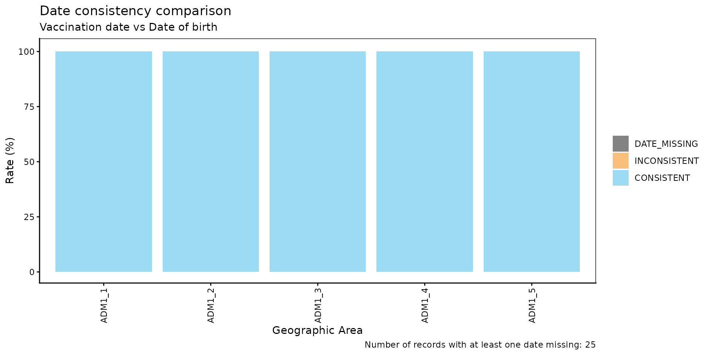
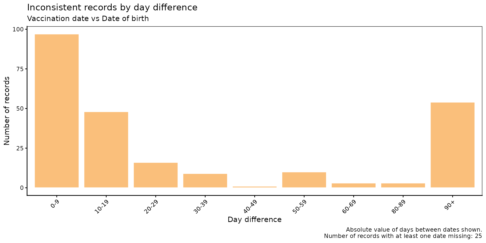
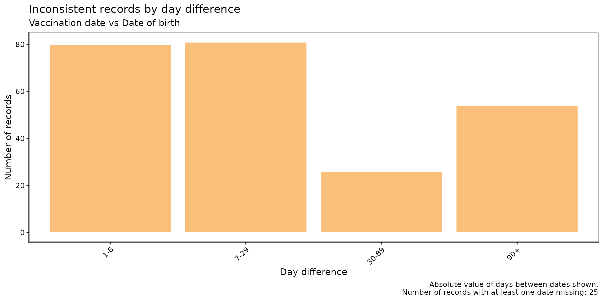

# Date Consistency Comparison

[🌐 Lea esto en
español](https://im-data-paho.github.io/pahoabc/articles/es/date_consistency_comparison_es.md)

## Rationale

Electronic Immunization Registries (EIRs) often contain date fields that
are logically constrained relative to one another. A common example is
the relationship between a vaccination date and a date of birth: a
vaccination event cannot occur before a person is born. When such
violations exist in the data, they indicate data entry errors or record
linkage issues that can bias downstream analyses.

The date consistency comparison module allows users to systematically
identify, quantify, and visualize these inconsistencies between any two
date variables in the EIR.

> **Note**
>
> All functions used for date consistency comparison analyses within
> PAHOabc begin with the `dcc_` prefix.

## Glossary

### Political Geographic Boundaries

Throughout this vignette, we will make reference to different levels of
political geographic boundaries. These levels are defined by the
country/territory and can have different names from country to country.
PAHOabc is agnostic to these names and requires the user to recode their
variable names to fit the PAHOabc structure.

Namely, PAHOabc can distinguish three administrative levels, which
listed from top to bottom level are: ADM0, ADM1 and ADM2.

1.  ADM0: The country. This is the top-most administrative level.
2.  ADM1: The first geographic subdivision in the country. ADM0 contains
    several ADM1 subdivisions.
3.  ADM2: The second geographic subdivision in the country. Each ADM1
    contains several ADM2 subdivisions.

### Consistency Categories

| Category | Meaning |
|----|----|
| `CONSISTENT` | `date_2` ≤ `date_1` — the chronological order is valid. |
| `INCONSISTENT` | `date_2` \> `date_1` — the chronological order is violated. |
| `DATE_MISSING` | At least one of the two dates is `NA`. |

## Usage

### Install Package

``` r

devtools::install_github("IM-Data-PAHO/pahoabc")
```

### Load Data

The functions in this module require your **EIR dataset** in the
standard PAHOabc format.

#### EIR

The
[`pahoabc::pahoabc.EIR`](https://im-data-paho.github.io/pahoabc/reference/pahoabc.EIR.md)
data frame provides a simulated, nominal-level table representing
individual vaccination events from an Electronic Immunization Registry
(EIR). Each row corresponds to a single vaccination act for a person.

``` r

pahoabc.EIR %>% head() %>% kable(caption = "Example Electronic Immunization Registry")
```

| ID | date_birth | date_vax | ADM1_residence | ADM2_residence | ADM1_occurrence | ADM2_occurrence | dose |
|---:|:---|:---|:---|:---|:---|:---|:---|
| 191997 | 2023-08-08 | 2023-12-26 | ADM1_4 | ADM2_4_35 | ADM1_4 | ADM2_4_35 | DTP2 |
| 212189 | 2023-12-20 | 2023-12-26 | ADM1_5 | ADM2_5_61 | ADM1_5 | ADM2_5_61 | BCG RN |
| 118063 | 2022-09-15 | 2023-12-26 | ADM1_2 | ADM2_2_5 | ADM1_2 | ADM2_2_5 | DTP1 |
| 118063 | 2022-09-15 | 2023-12-26 | ADM1_2 | ADM2_2_5 | ADM1_2 | ADM2_2_5 | YFV1 |
| 130751 | 2022-10-27 | 2023-12-12 | ADM1_5 | ADM2_5_55 | ADM1_5 | ADM2_5_55 | YFV1 |
| 136532 | 2021-09-21 | 2023-12-26 | ADM1_3 | ADM2_3_12 | ADM1_3 | ADM2_3_12 | SRP1 |

Example Electronic Immunization Registry {.table style="width:100%;"}

- `ID`: Unique person identification number.
- `date_birth`: Date of birth of person.
- `date_vax`: Date of vaccination event.
- `ADM1_residence` / `ADM2_residence`: First and second geographic
  administrative levels of residence.
- `dose`: Combined variable representing vaccine type and dose number
  (e.g., DTP1).

### Date Consistency Comparison Analysis

#### Expected Workflow

The `dcc_` suite contains four functions that work together:

1.  [`dcc_rate()`](https://im-data-paho.github.io/pahoabc/reference/dcc_rate.md)
    — computes consistency rates aggregated by geographic level.
2.  [`dcc_barplot()`](https://im-data-paho.github.io/pahoabc/reference/dcc_barplot.md)
    — visualizes the output of
    [`dcc_rate()`](https://im-data-paho.github.io/pahoabc/reference/dcc_rate.md)
    as a stacked bar chart.
3.  [`dcc_inconsistent()`](https://im-data-paho.github.io/pahoabc/reference/dcc_inconsistent.md)
    — lists individual inconsistent and missing records with their day
    difference.
4.  [`dcc_inconsistent_plot()`](https://im-data-paho.github.io/pahoabc/reference/dcc_inconsistent_plot.md)
    — visualizes the distribution of day differences for inconsistent
    records.

The figure below shows the expected workflow.


Figure 1. Expected workflow for the date consistency comparison
analysis.

  

#### Step 1 — Compute consistency rates with `dcc_rate()`

[`dcc_rate()`](https://im-data-paho.github.io/pahoabc/reference/dcc_rate.md)
compares two date variables in the EIR and returns, for each geographic
unit, the count and percentage of records that are `CONSISTENT`,
`INCONSISTENT`, or `DATE_MISSING`.

Here we check whether `date_vax` (date_1, the later date) is consistent
with `date_birth` (date_2, the earlier date) at the ADM1 level.

``` r

rate_df <- dcc_rate(
  data.EIR = pahoabc.EIR,
  date_1   = "date_vax",
  date_2   = "date_birth",
  geo_level = "ADM1"
)

rate_df %>% kable(digits = 2, caption = "Date consistency rates by ADM1")
```

| ADM1   | consistency  |      n |  total |  rate |
|:-------|:-------------|-------:|-------:|------:|
| ADM1_1 | CONSISTENT   |  14046 |  14058 | 99.91 |
| ADM1_1 | DATE_MISSING |      2 |  14058 |  0.01 |
| ADM1_1 | INCONSISTENT |     10 |  14058 |  0.07 |
| ADM1_2 | CONSISTENT   |  75128 |  75165 | 99.95 |
| ADM1_2 | INCONSISTENT |     37 |  75165 |  0.05 |
| ADM1_3 | CONSISTENT   | 332868 | 333038 | 99.95 |
| ADM1_3 | DATE_MISSING |     22 | 333038 |  0.01 |
| ADM1_3 | INCONSISTENT |    148 | 333038 |  0.04 |
| ADM1_4 | CONSISTENT   |  45797 |  45830 | 99.93 |
| ADM1_4 | DATE_MISSING |      1 |  45830 |  0.00 |
| ADM1_4 | INCONSISTENT |     32 |  45830 |  0.07 |
| ADM1_5 | CONSISTENT   |  24583 |  24597 | 99.94 |
| ADM1_5 | INCONSISTENT |     14 |  24597 |  0.06 |

Date consistency rates by ADM1 {.table}

##### Parameters accepted

- `data.EIR`: EIR data frame in PAHOabc format.
- `date_1`: Name of the date variable being checked (the chronologically
  later date).
- `date_2`: Name of the date variable checked against (the
  chronologically earlier date).
- `geo_level`: `"ADM0"` (default), `"ADM1"`, or `"ADM2"`.

#### Step 2 — Visualize rates with `dcc_barplot()`

The output of
[`dcc_rate()`](https://im-data-paho.github.io/pahoabc/reference/dcc_rate.md)
can be passed directly to
[`dcc_barplot()`](https://im-data-paho.github.io/pahoabc/reference/dcc_barplot.md)
to produce a stacked bar chart showing the breakdown of consistency
categories per geographic unit.

``` r

dcc_barplot(
  data        = rate_df,
  date_1_name = "Vaccination date",
  date_2_name = "Date of birth"
)
```



##### Parameters accepted

- `data`: Output of
  [`dcc_rate()`](https://im-data-paho.github.io/pahoabc/reference/dcc_rate.md).
- `date_1_name`: Display label for `date_1` in the plot subtitle.
  Default: `"date 1"`.
- `date_2_name`: Display label for `date_2` in the plot subtitle.
  Default: `"date 2"`.
- `within_ADM1`: Character vector to filter to specific ADM1 units when
  `geo_level = "ADM2"`. Default: `NULL`.
- `plot_missing`: Boolean. If `TRUE` (default), `DATE_MISSING` records
  are shown as a separate bar segment so all bars sum to 100%.

##### Interpretation

Each bar represents a geographic unit and is divided into three
segments: `CONSISTENT` (blue), `INCONSISTENT` (orange), and
`DATE_MISSING` (grey). Bars that are predominantly orange or grey
indicate units with data quality issues requiring attention.

#### Step 3 — Inspect individual inconsistent records with `dcc_inconsistent()`

[`dcc_inconsistent()`](https://im-data-paho.github.io/pahoabc/reference/dcc_inconsistent.md)
returns a record-level table of all `INCONSISTENT` and `DATE_MISSING`
entries, including the day difference between the two dates.

``` r

inconsistent_df <- dcc_inconsistent(
  data.EIR = pahoabc.EIR,
  date_1   = "date_vax",
  date_2   = "date_birth"
)

inconsistent_df %>% head(10) %>% kable(caption = "Sample of inconsistent and missing records")
```

|     ID | dose   | date_birth | date_vax   | consistency  | diff      |
|-------:|:-------|:-----------|:-----------|:-------------|:----------|
|  90618 | BCG RN | 2022-12-21 | 2022-02-25 | INCONSISTENT | -299 days |
| 212688 | BCG RN | 2023-12-28 | 2023-12-02 | INCONSISTENT | -26 days  |
|  90924 | BCG RN | 2022-03-06 | 2022-03-05 | INCONSISTENT | -1 days   |
|  90984 | DTP2   | 2022-06-30 | 2022-04-27 | INCONSISTENT | -64 days  |
|  90994 | BCG RN | 2022-02-20 | 2022-02-19 | INCONSISTENT | -1 days   |
|  91235 | YFV1   | NA         | 2022-06-13 | DATE_MISSING | NA days   |
|  91441 | BCG RN | 2022-02-16 | 2022-02-10 | INCONSISTENT | -6 days   |
|  91537 | BCG RN | 2022-04-02 | 2022-02-03 | INCONSISTENT | -58 days  |
|  65055 | BCG RN | 2022-02-04 | 2022-02-03 | INCONSISTENT | -1 days   |
|  92001 | BCG RN | 2022-03-17 | 2022-03-12 | INCONSISTENT | -5 days   |

Sample of inconsistent and missing records {.table}

##### Parameters accepted

- `data.EIR`: EIR data frame in PAHOabc format.
- `date_1`: Name of the date variable being checked.
- `date_2`: Name of the date variable checked against.

The `diff` column reports `date_1 - date_2` in days. Negative values
indicate `date_1` precedes `date_2` (i.e., the inconsistency). This
table can be exported for record-level correction workflows.

#### Step 4 — Visualize the distribution of day differences with `dcc_inconsistent_plot()`

[`dcc_inconsistent_plot()`](https://im-data-paho.github.io/pahoabc/reference/dcc_inconsistent_plot.md)
produces a histogram of the **absolute** day differences for
inconsistent records, grouped into customizable bins. This helps
characterize the severity of inconsistencies: small differences may
reflect data entry typos, while large differences suggest more
systematic issues.

``` r

dcc_inconsistent_plot(
  data.EIR    = pahoabc.EIR,
  date_1      = "date_vax",
  date_2      = "date_birth",
  date_1_name = "Vaccination date",
  date_2_name = "Date of birth"
)
```



##### Parameters accepted

- `data.EIR`: EIR data frame in PAHOabc format.
- `date_1`: Name of the date variable being checked.
- `date_2`: Name of the date variable checked against.
- `date_1_name`: Display label for `date_1` in the plot subtitle.
  Default: `"date 1"`.
- `date_2_name`: Display label for `date_2` in the plot subtitle.
  Default: `"date 2"`.
- `day_groups`: List of `c(lower, upper)` numeric pairs defining the
  histogram bins. The last bin is always extended to `Inf` and labelled
  `"X+"`. Default: 10-day bins from 0 to 100.

To use custom bin widths — for example, finer resolution for small
differences:

``` r

dcc_inconsistent_plot(
  data.EIR    = pahoabc.EIR,
  date_1      = "date_vax",
  date_2      = "date_birth",
  date_1_name = "Vaccination date",
  date_2_name = "Date of birth",
  day_groups  = list(c(0, 1), c(1, 7), c(7, 30), c(30, 90), c(90, 180))
)
```



##### Interpretation

The horizontal axis shows the number of days between inconsistent dates.
An investigation into the most common causes for the inconsistencies in
each bin should be performed. For example, records with large
differences can be caused by typos during data entry (e.g. when a date
is written as `2022-02-25` instead of `2022-12-25`). But, they can also
point to more serious systematic problems.

## Summary

The `dcc_` module provides a complete pipeline for assessing date
consistency in EIR data. Starting from
[`dcc_rate()`](https://im-data-paho.github.io/pahoabc/reference/dcc_rate.md)
for a geographic overview, through
[`dcc_barplot()`](https://im-data-paho.github.io/pahoabc/reference/dcc_barplot.md)
for visualization, to
[`dcc_inconsistent()`](https://im-data-paho.github.io/pahoabc/reference/dcc_inconsistent.md)
for record-level inspection and
[`dcc_inconsistent_plot()`](https://im-data-paho.github.io/pahoabc/reference/dcc_inconsistent_plot.md)
for characterizing the magnitude of errors, the suite equips data
managers and public health analysts with the tools needed to detect,
quantify, and prioritize data quality corrections before any downstream
analysis.
