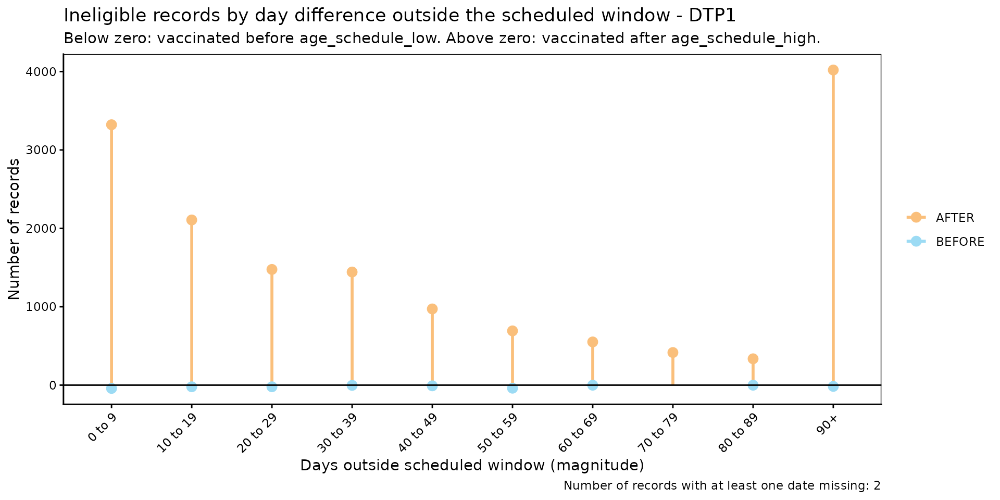

# Eligibility Consistency Comparison

[🌐 Lea esto en
español](https://im-data-paho.github.io/pahoabc/articles/es/eligibility_consistency_comparison_es.md)

## Rationale

National immunization schedules define, for each dose, a target age
window during which a person is expected to be vaccinated (e.g., DTP1
should be administered between 54 and 90 days of age). A vaccination
event that falls outside that window — administered too early or too
late — indicates either a data quality issue or a programmatic gap in
service delivery timeliness.

The eligibility consistency comparison module allows users to
systematically identify, quantify, and visualize whether the age at
vaccination (`date_vax - date_birth`) falls within the age window
defined by the vaccination schedule (`age_schedule_low`,
`age_schedule_high`).

> **Note**
>
> All functions used for eligibility consistency comparison analyses
> within PAHOabc begin with the `ecc_` prefix.

> **Warning**
>
> The `ecc_` functions calculate age at vaccination as
> `date_vax - date_birth`. If `data.EIR` contains records where
> `date_vax` occurs before `date_birth` (i.e., a negative age at
> vaccination), this points to a **date consistency** error rather than
> an eligibility one. When this happens, `ecc_` functions will emit a
> warning directing you to the [(D)ate (C)onsistency (C)omparison `dcc_`
> module](https://im-data-paho.github.io/pahoabc/articles/en/date_consistency_comparison_en.md)
> to identify and resolve those records first.

## Glossary

### Political Geographic Boundaries

Throughout this vignette, we will make reference to different levels of
political geographic boundaries. These levels are defined by the
country/territory and can have different names from country to country.
PAHOabc is agnostic to these names and requires the user to recode their
variable names to fit the PAHOabc structure.

Namely, PAHOabc can distinguish three administrative levels, which
listed from top to bottom level are: ADM0, ADM1 and ADM2.

1.  ADM0: The country. This is the top-most administrative level.
2.  ADM1: The first geographic subdivision in the country. ADM0 contains
    several ADM1 subdivisions.
3.  ADM2: The second geographic subdivision in the country. Each ADM1
    contains several ADM2 subdivisions.

### Eligibility Categories

| Category | Meaning |
|----|----|
| `ELIGIBLE` | The age at vaccination falls within `[age_schedule_low, age_schedule_high]`. |
| `INELIGIBLE` | The age at vaccination falls outside `[age_schedule_low, age_schedule_high]` — vaccinated too early or too late. |
| `DATE_MISSING` | `date_vax` or `date_birth` is `NA`. |

## Usage

### Install Package

``` r

devtools::install_github("IM-Data-PAHO/pahoabc")
```

### Load Data

The functions in this module require your **EIR dataset** and a
**vaccination schedule**, both in the standard PAHOabc format.

#### EIR

The
[`pahoabc::pahoabc.EIR`](https://im-data-paho.github.io/pahoabc/reference/pahoabc.EIR.md)
data frame provides a simulated, nominal-level table representing
individual vaccination events from an Electronic Immunization Registry
(EIR). Each row corresponds to a single vaccination act for a person.

``` r

pahoabc.EIR %>% head() %>% kable(caption = "Example Electronic Immunization Registry")
```

| ID | date_birth | date_vax | ADM1_residence | ADM2_residence | ADM1_occurrence | ADM2_occurrence | dose |
|---:|:---|:---|:---|:---|:---|:---|:---|
| 191997 | 2023-08-08 | 2023-12-26 | ADM1_4 | ADM2_4_35 | ADM1_4 | ADM2_4_35 | DTP2 |
| 212189 | 2023-12-20 | 2023-12-26 | ADM1_5 | ADM2_5_61 | ADM1_5 | ADM2_5_61 | BCG RN |
| 118063 | 2022-09-15 | 2023-12-26 | ADM1_2 | ADM2_2_5 | ADM1_2 | ADM2_2_5 | DTP1 |
| 118063 | 2022-09-15 | 2023-12-26 | ADM1_2 | ADM2_2_5 | ADM1_2 | ADM2_2_5 | YFV1 |
| 130751 | 2022-10-27 | 2023-12-12 | ADM1_5 | ADM2_5_55 | ADM1_5 | ADM2_5_55 | YFV1 |
| 136532 | 2021-09-21 | 2023-12-26 | ADM1_3 | ADM2_3_12 | ADM1_3 | ADM2_3_12 | SRP1 |

Example Electronic Immunization Registry {.table style="width:100%;"}

- `ID`: Unique person identification number.
- `date_birth`: Date of birth of person.
- `date_vax`: Date of vaccination event.
- `ADM1_residence` / `ADM2_residence`: First and second geographic
  administrative levels of residence.
- `dose`: Combined variable representing vaccine type and dose number
  (e.g., DTP1).

#### Vaccination Schedule

The
[`pahoabc::pahoabc.schedule`](https://im-data-paho.github.io/pahoabc/reference/pahoabc.schedule.md)
dataset defines the national immunization schedule, listing each vaccine
dose and the target age window for its administration, in days.

``` r

pahoabc.schedule %>% kable(caption = "Example Immunization Schedule")
```

| dose   | age_schedule | age_schedule_low | age_schedule_high |
|:-------|-------------:|-----------------:|------------------:|
| SRP1   |          365 |              360 |               420 |
| DTP1   |           60 |               54 |                90 |
| DTP2   |          120 |              116 |               150 |
| DTP3   |          180 |              176 |               210 |
| BCG RN |            0 |                0 |                28 |
| YFV1   |          365 |              360 |               420 |

Example Immunization Schedule {.table}

- `dose`: Combined variable representing vaccine type and dose number.
- `age_schedule`: The recommended age of administration of the
  corresponding `dose`, in days.
- `age_schedule_low`: The lower limit for the target age, in days.
- `age_schedule_high`: The upper limit for the target age, in days.

### Eligibility Consistency Comparison Analysis

#### Expected Workflow

The `ecc_` suite contains four functions that work together:

1.  [`ecc_rate()`](https://im-data-paho.github.io/pahoabc/reference/ecc_rate.md)
    — computes eligibility rates, optionally disaggregated by dose and
    geographic level.
2.  [`ecc_barplot()`](https://im-data-paho.github.io/pahoabc/reference/ecc_barplot.md)
    — visualizes the output of
    [`ecc_rate()`](https://im-data-paho.github.io/pahoabc/reference/ecc_rate.md)
    as a stacked bar chart.
3.  [`ecc_inconsistent()`](https://im-data-paho.github.io/pahoabc/reference/ecc_inconsistent.md)
    — lists individual ineligible and missing records with their day
    difference from the scheduled window.
4.  [`ecc_inconsistent_plot()`](https://im-data-paho.github.io/pahoabc/reference/ecc_inconsistent_plot.md)
    — visualizes the distribution of those day differences as a
    diverging lollipop plot.

The figure below shows the expected workflow.


Figure 1. Expected workflow for the eligibility consistency comparison
analysis.

  

#### Step 1 — Compute eligibility rates with `ecc_rate()`

[`ecc_rate()`](https://im-data-paho.github.io/pahoabc/reference/ecc_rate.md)
compares the age at vaccination against the scheduled age window and
returns the count and percentage of records that are `ELIGIBLE`,
`INELIGIBLE`, or `DATE_MISSING`.

By default, `vaccines = NULL` pools all doses in `data.schedule`
together. Here we compute pooled rates at the ADM1 level.

``` r

rate_df <- ecc_rate(
  data.EIR      = pahoabc.EIR,
  data.schedule = pahoabc.schedule,
  geo_level     = "ADM1"
)
```

    ## Warning in .validate_age_at_vax(prepare_EIR): Warning: 241 record(s) show a
    ## negative age at vaccination, meaning they were vaccinated before they were
    ## born. This indicates date consistency errors in data.EIR. Please check the
    ## (D)ate (C)onsistency (C)omparison dcc_ module (dcc_rate, dcc_inconsistent) to
    ## identify and resolve these records.

``` r

rate_df %>% kable(digits = 2, caption = "Pooled eligibility rates by ADM1")
```

| ADM1   | eligibility  |      n |  total |  rate |
|:-------|:-------------|-------:|-------:|------:|
| ADM1_1 | DATE_MISSING |      2 |  14058 |  0.01 |
| ADM1_1 | ELIGIBLE     |   7280 |  14058 | 51.79 |
| ADM1_1 | INELIGIBLE   |   6776 |  14058 | 48.20 |
| ADM1_2 | ELIGIBLE     |  46700 |  75165 | 62.13 |
| ADM1_2 | INELIGIBLE   |  28465 |  75165 | 37.87 |
| ADM1_3 | DATE_MISSING |     22 | 333038 |  0.01 |
| ADM1_3 | ELIGIBLE     | 198681 | 333038 | 59.66 |
| ADM1_3 | INELIGIBLE   | 134335 | 333038 | 40.34 |
| ADM1_4 | DATE_MISSING |      1 |  45830 |  0.00 |
| ADM1_4 | ELIGIBLE     |  36247 |  45830 | 79.09 |
| ADM1_4 | INELIGIBLE   |   9582 |  45830 | 20.91 |
| ADM1_5 | ELIGIBLE     |  17748 |  24597 | 72.16 |
| ADM1_5 | INELIGIBLE   |   6849 |  24597 | 27.84 |

Pooled eligibility rates by ADM1 {.table}

Specifying `vaccines` disaggregates the results by `dose`, one row set
per vaccine:

``` r

rate_by_dose_df <- ecc_rate(
  data.EIR      = pahoabc.EIR,
  data.schedule = pahoabc.schedule,
  geo_level     = "ADM1",
  vaccines      = c("DTP1", "DTP2", "DTP3")
)
```

    ## Warning in .validate_age_at_vax(prepare_EIR): Warning: 37 record(s) show a
    ## negative age at vaccination, meaning they were vaccinated before they were
    ## born. This indicates date consistency errors in data.EIR. Please check the
    ## (D)ate (C)onsistency (C)omparison dcc_ module (dcc_rate, dcc_inconsistent) to
    ## identify and resolve these records.

``` r

rate_by_dose_df %>% head(10) %>% kable(digits = 2, caption = "Eligibility rates by dose and ADM1")
```

| dose | ADM1   | eligibility  |     n | total |  rate |
|:-----|:-------|:-------------|------:|------:|------:|
| DTP1 | ADM1_1 | ELIGIBLE     |  1647 |  2629 | 62.65 |
| DTP1 | ADM1_1 | INELIGIBLE   |   982 |  2629 | 37.35 |
| DTP1 | ADM1_2 | ELIGIBLE     | 10401 | 12606 | 82.51 |
| DTP1 | ADM1_2 | INELIGIBLE   |  2205 | 12606 | 17.49 |
| DTP1 | ADM1_3 | DATE_MISSING |     2 | 56340 |  0.00 |
| DTP1 | ADM1_3 | ELIGIBLE     | 45482 | 56340 | 80.73 |
| DTP1 | ADM1_3 | INELIGIBLE   | 10856 | 56340 | 19.27 |
| DTP1 | ADM1_4 | ELIGIBLE     |  6864 |  7690 | 89.26 |
| DTP1 | ADM1_4 | INELIGIBLE   |   826 |  7690 | 10.74 |
| DTP1 | ADM1_5 | ELIGIBLE     |  3472 |  4091 | 84.87 |

Eligibility rates by dose and ADM1 {.table}

##### Parameters accepted

- `data.EIR`: EIR data frame in PAHOabc format.
- `data.schedule`: Vaccination schedule data frame in PAHOabc format.
- `geo_level`: `"ADM0"` (default), `"ADM1"`, or `"ADM2"`.
- `vaccines`: Character vector of doses to include, disaggregating by
  `dose`. Default `NULL` pools all doses in `data.schedule`.

#### Step 2 — Visualize rates with `ecc_barplot()`

The output of
[`ecc_rate()`](https://im-data-paho.github.io/pahoabc/reference/ecc_rate.md)
can be passed directly to
[`ecc_barplot()`](https://im-data-paho.github.io/pahoabc/reference/ecc_barplot.md)
to produce a stacked bar chart. If `data` is disaggregated by `dose`,
the plot is automatically faceted by dose.

``` r

ecc_barplot(data = rate_df)
```


``` r

ecc_barplot(data = rate_by_dose_df)
```


##### Parameters accepted

- `data`: Output of
  [`ecc_rate()`](https://im-data-paho.github.io/pahoabc/reference/ecc_rate.md).
- `within_ADM1`: Character vector to filter to specific ADM1 units when
  `geo_level = "ADM2"`. Default: `NULL`.
- `plot_missing`: Boolean. If `TRUE` (default), `DATE_MISSING` records
  are shown as a separate bar segment so all bars sum to 100%.

##### Interpretation

Each bar represents a geographic unit and is divided into segments:
`ELIGIBLE` (blue), `INELIGIBLE` (orange), and `DATE_MISSING` (grey).
Bars that are predominantly orange indicate units where a large share of
doses are administered outside the recommended age window — a signal
worth investigating for service delivery timeliness issues.

#### Step 3 — Inspect individual ineligible records with `ecc_inconsistent()`

[`ecc_inconsistent()`](https://im-data-paho.github.io/pahoabc/reference/ecc_inconsistent.md)
returns a record-level table of all `INELIGIBLE` and `DATE_MISSING`
entries, including the number of days outside the scheduled window.

``` r

inconsistent_df <- ecc_inconsistent(
  data.EIR      = pahoabc.EIR,
  data.schedule = pahoabc.schedule,
  vaccines      = "DTP1"
)
```

    ## Warning in .validate_age_at_vax(prepare_EIR): Warning: 19 record(s) show a
    ## negative age at vaccination, meaning they were vaccinated before they were
    ## born. This indicates date consistency errors in data.EIR. Please check the
    ## (D)ate (C)onsistency (C)omparison dcc_ module (dcc_rate, dcc_inconsistent) to
    ## identify and resolve these records.

``` r

inconsistent_df %>% head(10) %>% kable(caption = "Sample of ineligible and missing DTP1 records")
```

| ID | dose | date_birth | date_vax | age_at_vax | age_schedule_low | age_schedule_high | days_outside_range | eligibility |
|---:|:---|:---|:---|---:|---:|---:|---:|:---|
| 118063 | DTP1 | 2022-09-15 | 2023-12-26 | 467 | 54 | 90 | 377 | INELIGIBLE |
| 187807 | DTP1 | 2023-07-19 | 2023-12-26 | 160 | 54 | 90 | 70 | INELIGIBLE |
| 212197 | DTP1 | 2022-10-23 | 2023-12-19 | 422 | 54 | 90 | 332 | INELIGIBLE |
| 101916 | DTP1 | 2021-10-21 | 2022-01-24 | 95 | 54 | 90 | 5 | INELIGIBLE |
| 120150 | DTP1 | 2022-04-21 | 2022-08-23 | 124 | 54 | 90 | 34 | INELIGIBLE |
| 61279 | DTP1 | 2022-01-11 | 2022-04-18 | 97 | 54 | 90 | 7 | INELIGIBLE |
| 205838 | DTP1 | 2023-08-04 | 2023-12-28 | 146 | 54 | 90 | 56 | INELIGIBLE |
| 15488 | DTP1 | 2020-06-15 | 2022-02-23 | 618 | 54 | 90 | 528 | INELIGIBLE |
| 61972 | DTP1 | 2022-03-21 | 2022-06-20 | 91 | 54 | 90 | 1 | INELIGIBLE |
| 90337 | DTP1 | 2022-03-18 | 2022-06-20 | 94 | 54 | 90 | 4 | INELIGIBLE |

Sample of ineligible and missing DTP1 records {.table}

##### Parameters accepted

- `data.EIR`: EIR data frame in PAHOabc format.
- `data.schedule`: Vaccination schedule data frame in PAHOabc format.
- `vaccines`: Character vector of doses to include. Default `NULL`
  includes all doses in `data.schedule`.

The `days_outside_range` column is negative when a person was vaccinated
before `age_schedule_low`, and positive when vaccinated after
`age_schedule_high` (`NA` when a date is missing). This table can be
exported for record-level correction workflows.

#### Step 4 — Visualize the distribution of day differences with `ecc_inconsistent_plot()`

[`ecc_inconsistent_plot()`](https://im-data-paho.github.io/pahoabc/reference/ecc_inconsistent_plot.md)
produces a diverging lollipop plot of ineligible records, binned by the
**magnitude** of days outside the scheduled window. The same bins are
shared by both directions: records vaccinated too early are plotted
below zero, and records vaccinated too late are plotted above zero.

``` r

ecc_inconsistent_plot(
  data.EIR      = pahoabc.EIR,
  data.schedule = pahoabc.schedule,
  vaccines      = "DTP1"
)
```

    ## Warning in .validate_age_at_vax(prepare_EIR): Warning: 19 record(s) show a
    ## negative age at vaccination, meaning they were vaccinated before they were
    ## born. This indicates date consistency errors in data.EIR. Please check the
    ## (D)ate (C)onsistency (C)omparison dcc_ module (dcc_rate, dcc_inconsistent) to
    ## identify and resolve these records.



When more than one vaccine is specified, the plot is automatically
faceted by dose:

``` r

ecc_inconsistent_plot(
  data.EIR      = pahoabc.EIR,
  data.schedule = pahoabc.schedule,
  vaccines      = c("DTP1", "DTP2", "DTP3")
)
```

    ## Warning in .validate_age_at_vax(prepare_EIR): Warning: 37 record(s) show a
    ## negative age at vaccination, meaning they were vaccinated before they were
    ## born. This indicates date consistency errors in data.EIR. Please check the
    ## (D)ate (C)onsistency (C)omparison dcc_ module (dcc_rate, dcc_inconsistent) to
    ## identify and resolve these records.


##### Parameters accepted

- `data.EIR`: EIR data frame in PAHOabc format.
- `data.schedule`: Vaccination schedule data frame in PAHOabc format.
- `vaccines`: Character vector of doses to include, faceting the plot by
  `dose` when more than one is given. Default `NULL` pools all doses in
  `data.schedule` (no facet).
- `day_groups`: List of `c(lower, upper)` numeric pairs defining the
  magnitude bins shared by both directions. The last bin is always
  extended to `Inf` and labelled `"X+"`. Default: 10-day bins from 0 to
  100.

To use custom bin widths — for example, finer resolution for small
differences:

``` r

ecc_inconsistent_plot(
  data.EIR      = pahoabc.EIR,
  data.schedule = pahoabc.schedule,
  vaccines      = "DTP1",
  day_groups    = list(c(0, 5), c(5, 15), c(15, 30), c(30, 60), c(60, 120))
)
```

    ## Warning in .validate_age_at_vax(prepare_EIR): Warning: 19 record(s) show a
    ## negative age at vaccination, meaning they were vaccinated before they were
    ## born. This indicates date consistency errors in data.EIR. Please check the
    ## (D)ate (C)onsistency (C)omparison dcc_ module (dcc_rate, dcc_inconsistent) to
    ## identify and resolve these records.


##### Interpretation

The horizontal axis shows the magnitude of days outside the scheduled
window, shared by both directions. Points below zero represent records
vaccinated too early (before `age_schedule_low`); points above zero
represent records vaccinated too late (after `age_schedule_high`). Bins
with large “too late” counts often point to programmatic delays in
service delivery, while “too early” counts can point to data entry
errors or off-schedule vaccination campaigns.

## Summary

The `ecc_` module provides a complete pipeline for assessing eligibility
consistency in EIR data. Starting from
[`ecc_rate()`](https://im-data-paho.github.io/pahoabc/reference/ecc_rate.md)
for a geographic and dose-level overview, through
[`ecc_barplot()`](https://im-data-paho.github.io/pahoabc/reference/ecc_barplot.md)
for visualization, to
[`ecc_inconsistent()`](https://im-data-paho.github.io/pahoabc/reference/ecc_inconsistent.md)
for record-level inspection and
[`ecc_inconsistent_plot()`](https://im-data-paho.github.io/pahoabc/reference/ecc_inconsistent_plot.md)
for characterizing the magnitude and direction of timing errors, the
suite equips data managers and public health analysts with the tools
needed to detect, quantify, and prioritize service delivery timeliness
issues.
