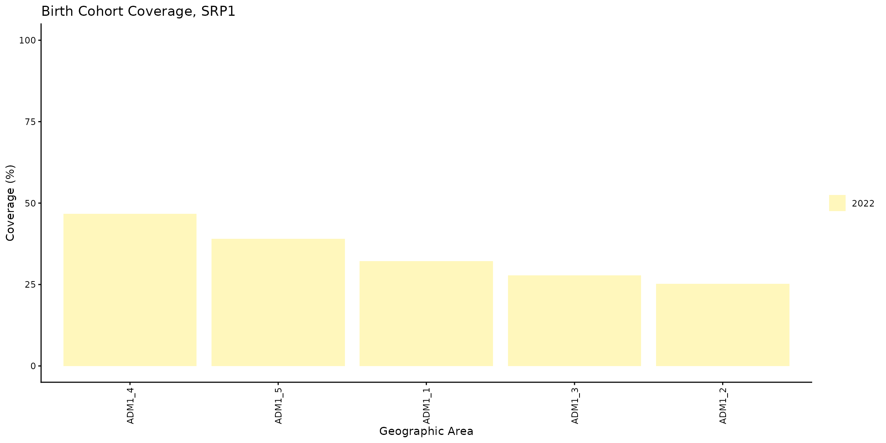

# Cobertura por cohorte de nacimiento

[🌐 Read this in
English](https://im-data-paho.github.io/pahoabc/articles/en/birth_cohort_coverage_en.md)

## Fundamento

El objetivo de este indicador es dar seguimiento a una cohorte
específica de recién nacidos para conocer su estado de vacunación y
estimar el nivel de protección de la población frente a las enfermedades
prevenibles por vacunación. Este análisis ayuda a prevenir la
acumulación de personas susceptibles, fortalecer la inmunidad colectiva
y orientar estrategias de vacunación para quienes no han recibido las
dosis necesarias.

La cobertura de vacunación por cohorte de nacimiento se calcula mediante
la siguiente fórmula:

``` math
\text{Cobertura por cohorte de nacimiento (\%)} =
\frac{\text{# de personas vacunadas en una cohorte de nacimiento específica}}{\text{Total de personas en esa cohorte de nacimiento}} \times 100
```

> **Nota**
>
> Todas las funciones utilizadas para los análisis de cobertura por
> cohorte de nacimiento dentro de PAHOabc comienzan con el prefijo
> `bc_`.

## Glosario

### Cohorte de nacimiento

Una cohorte de nacimiento es el grupo de todas las personas nacidas
dentro de un mismo período de tiempo, normalmente un único año
calendario. Por ejemplo, la cohorte de nacimiento de 2022 comprende a
todas las personas nacidas durante el año 2022.

### Divisiones político-geográficas

A lo largo de esta viñeta se hace referencia a distintos niveles de
división político-geográfica. Estos niveles son definidos por cada país
o territorio y pueden recibir nombres diferentes. PAHOabc no depende de
esos nombres locales; por eso, el usuario debe recodificar sus variables
para ajustarlas a la estructura que utiliza el paquete.

En concreto, PAHOabc puede distinguir tres niveles administrativos que,
listados del nivel superior al inferior, son: ADM0, ADM1 y ADM2.

1.  ADM0: El país. Este es el nivel administrativo más alto.
2.  ADM1: La primera subdivisión geográfica del país. ADM0 contiene
    varias subdivisiones ADM1.
3.  ADM2: La segunda subdivisión geográfica del país. Cada ADM1 contiene
    varias subdivisiones ADM2.

### Nombres de vacunas

Los conjuntos de datos de ejemplo utilizan una convención específica
para nombrar las dosis de vacunas. Es posible que esta convención no
coincida con la que usa su país o institución, pero esto no afecta el
uso del paquete si los nombres se aplican de manera consistente.

Por ejemplo, los nombres de las vacunas utilizados en el paquete PAHOabc
son:

| Abreviatura | Nombre completo                                          |
|-------------|----------------------------------------------------------|
| SRP1        | Vacuna contra sarampión, rubéola y paperas (1.ª dosis)   |
| DTP1        | Vacuna contra difteria, tétanos y tos ferina (1.ª dosis) |
| DTP2        | Vacuna contra difteria, tétanos y tos ferina (2.ª dosis) |
| DTP3        | Vacuna contra difteria, tétanos y tos ferina (3.ª dosis) |
| BCG RN      | Vacuna Bacillus Calmette–Guérin (al nacer)               |
| YFV1        | Vacuna contra la fiebre amarilla (1.ª dosis)             |

## Uso

### Instalar el paquete

El primer paso para ejecutar los análisis de cobertura por cohorte de
nacimiento es instalar el paquete PAHOabc disponible en GitHub.

``` r

devtools::install_github("IM-Data-PAHO/pahoabc")
```

### Cargar los datos

Las funciones de este módulo requieren tres conjuntos de datos en un
formato específico.

1.  Su RNVe.
2.  El esquema de vacunación relacionado con este RNVe.
3.  Opcionalmente, una tabla con denominadores poblacionales al mismo
    nivel geográfico de desagregación que su análisis.

Para facilitar la prueba de PAHOabc y la comprensión de la estructura
requerida, a continuación se presentan los conjuntos de datos de ejemplo
que utiliza este módulo.

#### RNVe

El conjunto de datos
[`pahoabc::pahoabc.EIR`](https://im-data-paho.github.io/pahoabc/reference/pahoabc.EIR.md)
proporciona un ejemplo de Registro Nominal de Vacunación electrónico
(RNVe). Es una tabla nominal simulada con eventos individuales de
vacunación. Cada fila corresponde a una vacunación e incluye información
sobre la residencia de la persona, el lugar donde fue vacunada
(ocurrencia), su fecha de nacimiento y la dosis recibida.

``` r

pahoabc.EIR %>% head() %>% kable(caption = "Ejemplo de Registro Nominal de Vacunación electrónico")
```

| ID | date_birth | date_vax | ADM1_residence | ADM2_residence | ADM1_occurrence | ADM2_occurrence | dose |
|---:|:---|:---|:---|:---|:---|:---|:---|
| 191997 | 2023-08-08 | 2023-12-26 | ADM1_4 | ADM2_4_35 | ADM1_4 | ADM2_4_35 | DTP2 |
| 212189 | 2023-12-20 | 2023-12-26 | ADM1_5 | ADM2_5_61 | ADM1_5 | ADM2_5_61 | BCG RN |
| 118063 | 2022-09-15 | 2023-12-26 | ADM1_2 | ADM2_2_5 | ADM1_2 | ADM2_2_5 | DTP1 |
| 118063 | 2022-09-15 | 2023-12-26 | ADM1_2 | ADM2_2_5 | ADM1_2 | ADM2_2_5 | YFV1 |
| 130751 | 2022-10-27 | 2023-12-12 | ADM1_5 | ADM2_5_55 | ADM1_5 | ADM2_5_55 | YFV1 |
| 136532 | 2021-09-21 | 2023-12-26 | ADM1_3 | ADM2_3_12 | ADM1_3 | ADM2_3_12 | SRP1 |

Ejemplo de Registro Nominal de Vacunación electrónico {.table
style="width:100%;"}

- `ID`: Número único de identificación de la persona.
- Fecha de nacimiento (`date_birth`): Fecha de nacimiento de la persona.
- Fecha de vacunación (`date_vax`): Fecha del evento de vacunación.
- ADM1: Primer nivel administrativo geográfico del país.
- ADM2: Segundo nivel administrativo geográfico del país.
- Lugar de residencia (`Residence`): Lugar donde vive la persona.
- Lugar de vacunación (`Occurrence`): Lugar donde ocurrió la vacunación.
- Dosis (`dose`): Variable combinada que representa el tipo de vacuna y
  su número de dosis correspondiente. Por ejemplo, DTP1 se refiere a la
  primera dosis de una vacuna que contiene componentes de difteria,
  tétanos y tos ferina.

#### Esquema de vacunación

El conjunto de datos
[`pahoabc::pahoabc.schedule`](https://im-data-paho.github.io/pahoabc/reference/pahoabc.schedule.md)
define el esquema nacional de vacunación, con cada dosis y su edad
recomendada de administración (en días). Esta tabla permite determinar
si una persona tiene las vacunas que le corresponden según el esquema.

``` r

pahoabc.schedule %>% kable(caption = "Ejemplo de esquema de vacunación")
```

| dose   | age_schedule | age_schedule_low | age_schedule_high |
|:-------|-------------:|-----------------:|------------------:|
| SRP1   |          365 |              360 |               420 |
| DTP1   |           60 |               54 |                90 |
| DTP2   |          120 |              116 |               150 |
| DTP3   |          180 |              176 |               210 |
| BCG RN |            0 |                0 |                28 |
| YFV1   |          365 |              360 |               420 |

Ejemplo de esquema de vacunación {.table}

- Dosis (`dose`): Variable combinada que representa el tipo de vacuna y
  su número de dosis correspondiente. Por ejemplo, DTP1 se refiere a la
  primera dosis de una vacuna que contiene componentes de difteria,
  tétanos y tos ferina.
- Edad programada (`age_schedule`): Edad recomendada de administración
  de la dosis, en días.
- Límite inferior de edad (`age_schedule_low`): Límite inferior de la
  edad objetivo, en días.
- Límite superior de edad (`age_schedule_high`): Límite superior de la
  edad objetivo, en días.

> **Nota**
>
> Los nombres de las dosis en la columna `dose` deben coincidir
> exactamente con los del conjunto de datos `pahoabc.EIR`.

#### Denominadores poblacionales

Aunque no es obligatorio, este módulo permite usar una tabla de
población como denominador para calcular la cobertura. El nivel
geográfico de esta tabla debe coincidir con el nivel geográfico del
análisis. Por ejemplo, para un análisis a nivel ADM1, la tabla de
denominadores poblacionales debe tener la siguiente estructura.

``` r

pahoabc.pop.ADM1 %>% head() %>% kable(caption = "Ejemplo de población a nivel ADM1")
```

| ADM1   | year | age | population |
|:-------|-----:|----:|-----------:|
| ADM1_1 | 2022 |   0 |   1718.189 |
| ADM1_1 | 2022 |   1 |   1808.964 |
| ADM1_1 | 2023 |   0 |   1703.145 |
| ADM1_1 | 2023 |   1 |   1792.443 |
| ADM1_2 | 2022 |   0 |   6575.261 |
| ADM1_2 | 2022 |   1 |   6922.644 |

Ejemplo de población a nivel ADM1 {.table}

Esta tabla está en formato largo y contiene la población (`population`)
de niños de una edad (`age`) específica durante un año (`year`)
determinado para un nivel `ADM1`.

> **Nota**
>
> Como este análisis se realiza con cohortes de nacimiento, solo se usan
> las filas donde la edad (`age`) es igual a 0 en la tabla de población.
> Estas filas representan el número de niños que pertenecen a esa
> cohorte de nacimiento.

### Análisis de cobertura por cohorte de nacimiento

Este módulo permite estimar la cobertura de vacunación por cohorte de
nacimiento para cualquier vacuna. Para interpretar correctamente los
resultados, tenga en cuenta que el indicador representa el porcentaje de
personas vacunadas dentro de un año de nacimiento específico,
independientemente del año en que fueron vacunadas. Por eso puede
diferir de la cobertura administrativa de un año determinado. El usuario
también puede seleccionar el nivel de agregación de los resultados:
nacional, ADM1 o ADM2.

#### Flujo de trabajo esperado

Las funciones
[`bc_coverage()`](https://im-data-paho.github.io/pahoabc/reference/bc_coverage.md)
y
[`bc_barplot()`](https://im-data-paho.github.io/pahoabc/reference/bc_barplot.md)
permiten analizar y visualizar la cobertura por cohorte de nacimiento.
Su relación se muestra en la Figura 1.


Figura 1. Flujo de trabajo esperado para el análisis de cobertura por
cohorte de nacimiento.

  

#### Ejemplo

A continuación se muestra un caso de uso sencillo de
[`bc_coverage()`](https://im-data-paho.github.io/pahoabc/reference/bc_coverage.md)
en el que se calcula la cobertura de vacunación de la primera dosis de
la vacuna que contiene sarampión para la cohorte de nacimiento de 2022.

``` r

# calcular la cobertura
coverage_df <- bc_coverage(
  data.EIR = pahoabc.EIR,
  data.schedule = pahoabc.schedule,
  geo_level = "ADM1",
  vaccines = "SRP1", # esto puede ser un vector de vacunas
  birth_cohorts = 2022 # esto puede ser un vector de años
)

# mostrar los resultados en una tabla
coverage_df %>%
  kable(digits = 2, caption = "Cobertura por cohorte de nacimiento a nivel ADM1")
```

| dose | year_cohort | ADM1   | numerator | population | coverage |
|:-----|------------:|:-------|----------:|-----------:|---------:|
| SRP1 |        2022 | ADM1_1 |       558 |       1733 |    32.20 |
| SRP1 |        2022 | ADM1_2 |      3138 |      12428 |    25.25 |
| SRP1 |        2022 | ADM1_3 |     13967 |      50238 |    27.80 |
| SRP1 |        2022 | ADM1_4 |      2977 |       6382 |    46.65 |
| SRP1 |        2022 | ADM1_5 |      1362 |       3488 |    39.05 |

Cobertura por cohorte de nacimiento a nivel ADM1 {.table}

Estos resultados se pueden visualizar con la función
[`bc_barplot()`](https://im-data-paho.github.io/pahoabc/reference/bc_barplot.md),
como se muestra a continuación.

``` r

# visualizar el resultado de bc_coverage()
coverage_plot <- bc_barplot(data = coverage_df, vaccine = "SRP1")

# mostrar
coverage_plot
```



La revisión de los niveles subnacionales muestra una diferencia
importante: `ADM1_4` presenta el mejor resultado de vacunación (~47 %),
mientras que `ADM1_2` presenta el resultado más bajo (~25 %).

## Resumen

Al incorporar la cobertura de vacunación por cohorte de nacimiento,
PAHOabc ayuda a las autoridades de salud a evaluar el nivel de
protección de grupos poblacionales específicos dentro de un territorio.
Esta información es útil para la planificación estratégica, incluidas
las campañas de seguimiento contra el sarampión y la rubéola, y las
estrategias de vacunación de puesta al día contra el VPH.
