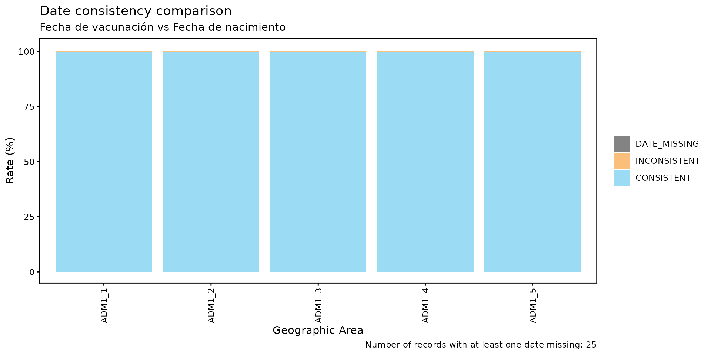
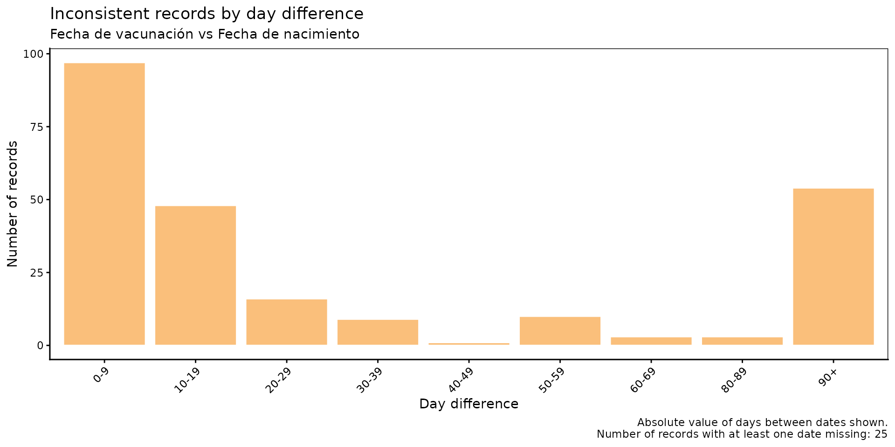
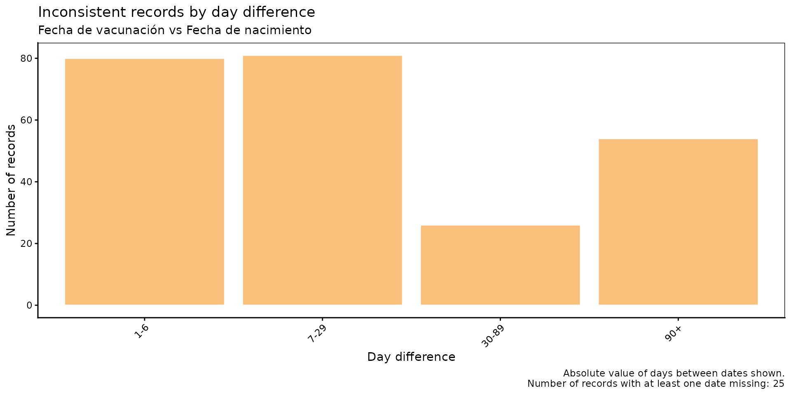

# Comparación de consistencia de fechas

[🌐 Read this in
English](https://im-data-paho.github.io/pahoabc/articles/en/date_consistency_comparison_en.md)

## Fundamento

Los Registros Nominales de Vacunación electrónicos (RNVe) suelen
contener campos de fecha con restricciones lógicas entre sí. Un ejemplo
común es la relación entre la fecha de vacunación y la fecha de
nacimiento: un evento de vacunación no puede ocurrir antes de que la
persona haya nacido. Cuando estas violaciones existen en los datos,
indican errores de captura o problemas de vinculación de registros que
pueden sesgar los análisis posteriores.

El módulo de comparación de consistencia de fechas permite identificar,
cuantificar y visualizar de forma sistemática estas inconsistencias
entre cualquier par de variables de fecha en el RNVe.

> **Nota**
>
> Todas las funciones utilizadas para los análisis de comparación de
> consistencia de fechas dentro de PAHOabc comienzan con el prefijo
> `dcc_`.

## Glosario

### Divisiones político-geográficas

A lo largo de esta viñeta se hace referencia a distintos niveles de
división político-geográfica. Estos niveles son definidos por cada país
o territorio y pueden recibir nombres diferentes. PAHOabc no depende de
esos nombres locales; por eso, el usuario debe recodificar sus variables
para ajustarlas a la estructura que utiliza el paquete.

En concreto, PAHOabc puede distinguir tres niveles administrativos que,
listados del nivel superior al inferior, son: ADM0, ADM1 y ADM2.

1.  ADM0: El país. Este es el nivel administrativo más alto.
2.  ADM1: La primera subdivisión geográfica del país. ADM0 contiene
    varias subdivisiones ADM1.
3.  ADM2: La segunda subdivisión geográfica del país. Cada ADM1 contiene
    varias subdivisiones ADM2.

### Categorías de consistencia

| Categoría      | Significado                                               |
|----------------|-----------------------------------------------------------|
| `CONSISTENT`   | `date_2` ≤ `date_1` — el orden cronológico es válido.     |
| `INCONSISTENT` | `date_2` \> `date_1` — el orden cronológico está violado. |
| `DATE_MISSING` | Al menos una de las dos fechas es `NA`.                   |

## Uso

### Instalar el paquete

``` r

devtools::install_github("IM-Data-PAHO/pahoabc")
```

### Cargar los datos

Las funciones de este módulo requieren que proporcione su **RNVe** en el
formato estándar de PAHOabc.

#### RNVe

El conjunto de datos
[`pahoabc::pahoabc.EIR`](https://im-data-paho.github.io/pahoabc/reference/pahoabc.EIR.md)
proporciona una tabla nominal simulada con eventos individuales de
vacunación de un Registro Nominal de Vacunación electrónico (RNVe). Cada
fila corresponde a una vacunación de una persona.

``` r

pahoabc.EIR %>% head() %>% kable(caption = "Ejemplo de Registro Nominal de Vacunación electrónico")
```

| ID | date_birth | date_vax | ADM1_residence | ADM2_residence | ADM1_occurrence | ADM2_occurrence | dose |
|---:|:---|:---|:---|:---|:---|:---|:---|
| 191997 | 2023-08-08 | 2023-12-26 | ADM1_4 | ADM2_4_35 | ADM1_4 | ADM2_4_35 | DTP2 |
| 212189 | 2023-12-20 | 2023-12-26 | ADM1_5 | ADM2_5_61 | ADM1_5 | ADM2_5_61 | BCG RN |
| 118063 | 2022-09-15 | 2023-12-26 | ADM1_2 | ADM2_2_5 | ADM1_2 | ADM2_2_5 | DTP1 |
| 118063 | 2022-09-15 | 2023-12-26 | ADM1_2 | ADM2_2_5 | ADM1_2 | ADM2_2_5 | YFV1 |
| 130751 | 2022-10-27 | 2023-12-12 | ADM1_5 | ADM2_5_55 | ADM1_5 | ADM2_5_55 | YFV1 |
| 136532 | 2021-09-21 | 2023-12-26 | ADM1_3 | ADM2_3_12 | ADM1_3 | ADM2_3_12 | SRP1 |

Ejemplo de Registro Nominal de Vacunación electrónico {.table
style="width:100%;"}

- `ID`: Número único de identificación de la persona.
- Fecha de nacimiento (`date_birth`): Fecha de nacimiento de la persona.
- Fecha de vacunación (`date_vax`): Fecha del evento de vacunación.
- `ADM1_residence` / `ADM2_residence`: Primer y segundo nivel
  administrativo geográfico de residencia.
- Dosis (`dose`): Variable combinada que representa el tipo de vacuna y
  su número de dosis correspondiente (p. ej., DTP1).

### Análisis de comparación de consistencia de fechas

#### Flujo de trabajo esperado

El conjunto de funciones `dcc_` contiene cuatro funciones que trabajan
en conjunto:

1.  [`dcc_rate()`](https://im-data-paho.github.io/pahoabc/reference/dcc_rate.md)
    — calcula las tasas de consistencia agregadas por nivel geográfico.
2.  [`dcc_barplot()`](https://im-data-paho.github.io/pahoabc/reference/dcc_barplot.md)
    — visualiza el resultado de
    [`dcc_rate()`](https://im-data-paho.github.io/pahoabc/reference/dcc_rate.md)
    como un gráfico de barras apiladas.
3.  [`dcc_inconsistent()`](https://im-data-paho.github.io/pahoabc/reference/dcc_inconsistent.md)
    — lista los registros inconsistentes e incompletos de forma
    individual, con su diferencia en días.
4.  [`dcc_inconsistent_plot()`](https://im-data-paho.github.io/pahoabc/reference/dcc_inconsistent_plot.md)
    — visualiza la distribución de las diferencias en días para los
    registros inconsistentes.

La figura a continuación muestra el flujo de trabajo esperado.


Figura 1. Flujo de trabajo esperado para el análisis de comparación de
consistencia de fechas.

  

#### Paso 1 — Calcular las tasas de consistencia con `dcc_rate()`

[`dcc_rate()`](https://im-data-paho.github.io/pahoabc/reference/dcc_rate.md)
compara dos variables de fecha en el RNVe y devuelve, para cada unidad
geográfica, el conteo y el porcentaje de registros clasificados como
`CONSISTENT`, `INCONSISTENT` o `DATE_MISSING`.

En este ejemplo se verifica si `date_vax` (date_1, la fecha más
reciente) es consistente con `date_birth` (date_2, la fecha más
temprana) a nivel ADM1.

``` r

rate_df <- dcc_rate(
  data.EIR  = pahoabc.EIR,
  date_1    = "date_vax",
  date_2    = "date_birth",
  geo_level = "ADM1"
)

rate_df %>% kable(digits = 2, caption = "Tasas de consistencia de fechas por ADM1")
```

| ADM1   | consistency  |      n |  total |  rate |
|:-------|:-------------|-------:|-------:|------:|
| ADM1_1 | CONSISTENT   |  14046 |  14058 | 99.91 |
| ADM1_1 | DATE_MISSING |      2 |  14058 |  0.01 |
| ADM1_1 | INCONSISTENT |     10 |  14058 |  0.07 |
| ADM1_2 | CONSISTENT   |  75128 |  75165 | 99.95 |
| ADM1_2 | INCONSISTENT |     37 |  75165 |  0.05 |
| ADM1_3 | CONSISTENT   | 332868 | 333038 | 99.95 |
| ADM1_3 | DATE_MISSING |     22 | 333038 |  0.01 |
| ADM1_3 | INCONSISTENT |    148 | 333038 |  0.04 |
| ADM1_4 | CONSISTENT   |  45797 |  45830 | 99.93 |
| ADM1_4 | DATE_MISSING |      1 |  45830 |  0.00 |
| ADM1_4 | INCONSISTENT |     32 |  45830 |  0.07 |
| ADM1_5 | CONSISTENT   |  24583 |  24597 | 99.94 |
| ADM1_5 | INCONSISTENT |     14 |  24597 |  0.06 |

Tasas de consistencia de fechas por ADM1 {.table}

##### Parámetros aceptados

- `data.EIR`: Tabla del RNVe en formato PAHOabc.
- `date_1`: Nombre de la variable de fecha que se verifica (la fecha
  cronológicamente más reciente).
- `date_2`: Nombre de la variable de fecha de referencia (la fecha
  cronológicamente más temprana).
- `geo_level`: `"ADM0"` (predeterminado), `"ADM1"` o `"ADM2"`.

#### Paso 2 — Visualizar las tasas con `dcc_barplot()`

El resultado de
[`dcc_rate()`](https://im-data-paho.github.io/pahoabc/reference/dcc_rate.md)
puede pasarse directamente a
[`dcc_barplot()`](https://im-data-paho.github.io/pahoabc/reference/dcc_barplot.md)
para producir un gráfico de barras apiladas con el desglose de
categorías de consistencia por unidad geográfica.

``` r

dcc_barplot(
  data        = rate_df,
  date_1_name = "Fecha de vacunación",
  date_2_name = "Fecha de nacimiento"
)
```



##### Parámetros aceptados

- `data`: Resultado de
  [`dcc_rate()`](https://im-data-paho.github.io/pahoabc/reference/dcc_rate.md).
- `date_1_name`: Etiqueta para `date_1` en el subtítulo del gráfico.
  Valor predeterminado: `"date 1"`.
- `date_2_name`: Etiqueta para `date_2` en el subtítulo del gráfico.
  Valor predeterminado: `"date 2"`.
- `within_ADM1`: Vector de caracteres para filtrar unidades ADM1
  específicas cuando `geo_level = "ADM2"`. Valor predeterminado: `NULL`.
- `plot_missing`: Booleano. Si es `TRUE` (predeterminado), los registros
  `DATE_MISSING` se muestran como un segmento separado para que todas
  las barras sumen 100 %.

##### Interpretación

Cada barra representa una unidad geográfica y se divide en tres
segmentos: `CONSISTENT` (azul), `INCONSISTENT` (naranja) y
`DATE_MISSING` (gris). Las barras con predominio de naranja o gris
indican unidades con problemas de calidad de datos que requieren
atención.

#### Paso 3 — Inspeccionar los registros inconsistentes con `dcc_inconsistent()`

[`dcc_inconsistent()`](https://im-data-paho.github.io/pahoabc/reference/dcc_inconsistent.md)
devuelve una tabla a nivel de registro con todas las entradas
`INCONSISTENT` y `DATE_MISSING`, incluyendo la diferencia en días entre
las dos fechas.

``` r

inconsistent_df <- dcc_inconsistent(
  data.EIR = pahoabc.EIR,
  date_1   = "date_vax",
  date_2   = "date_birth"
)

inconsistent_df %>% head(10) %>% kable(caption = "Muestra de registros inconsistentes e incompletos")
```

|     ID | dose   | date_birth | date_vax   | consistency  | diff      |
|-------:|:-------|:-----------|:-----------|:-------------|:----------|
|  90618 | BCG RN | 2022-12-21 | 2022-02-25 | INCONSISTENT | -299 days |
| 212688 | BCG RN | 2023-12-28 | 2023-12-02 | INCONSISTENT | -26 days  |
|  90924 | BCG RN | 2022-03-06 | 2022-03-05 | INCONSISTENT | -1 days   |
|  90984 | DTP2   | 2022-06-30 | 2022-04-27 | INCONSISTENT | -64 days  |
|  90994 | BCG RN | 2022-02-20 | 2022-02-19 | INCONSISTENT | -1 days   |
|  91235 | YFV1   | NA         | 2022-06-13 | DATE_MISSING | NA days   |
|  91441 | BCG RN | 2022-02-16 | 2022-02-10 | INCONSISTENT | -6 days   |
|  91537 | BCG RN | 2022-04-02 | 2022-02-03 | INCONSISTENT | -58 days  |
|  65055 | BCG RN | 2022-02-04 | 2022-02-03 | INCONSISTENT | -1 days   |
|  92001 | BCG RN | 2022-03-17 | 2022-03-12 | INCONSISTENT | -5 days   |

Muestra de registros inconsistentes e incompletos {.table}

##### Parámetros aceptados

- `data.EIR`: Tabla del RNVe en formato PAHOabc.
- `date_1`: Nombre de la variable de fecha que se verifica.
- `date_2`: Nombre de la variable de fecha de referencia.

La columna `diff` reporta `date_1 - date_2` en días. Los valores
negativos indican que `date_1` precede a `date_2` (es decir, la
inconsistencia). Esta tabla puede exportarse para flujos de corrección a
nivel de registro.

#### Paso 4 — Visualizar la distribución de las diferencias en días con `dcc_inconsistent_plot()`

[`dcc_inconsistent_plot()`](https://im-data-paho.github.io/pahoabc/reference/dcc_inconsistent_plot.md)
produce un histograma de las diferencias en días en **valor absoluto**
para los registros inconsistentes, agrupados en intervalos
personalizables. Esto permite caracterizar la gravedad de las
inconsistencias: diferencias pequeñas pueden reflejar errores de
captura, mientras que diferencias grandes pueden indicar problemas
sistemáticos más serios.

``` r

dcc_inconsistent_plot(
  data.EIR    = pahoabc.EIR,
  date_1      = "date_vax",
  date_2      = "date_birth",
  date_1_name = "Fecha de vacunación",
  date_2_name = "Fecha de nacimiento"
)
```



##### Parámetros aceptados

- `data.EIR`: Tabla del RNVe en formato PAHOabc.
- `date_1`: Nombre de la variable de fecha que se verifica.
- `date_2`: Nombre de la variable de fecha de referencia.
- `date_1_name`: Etiqueta para `date_1` en el subtítulo del gráfico.
  Valor predeterminado: `"date 1"`.
- `date_2_name`: Etiqueta para `date_2` en el subtítulo del gráfico.
  Valor predeterminado: `"date 2"`.
- `day_groups`: Lista de pares numéricos `c(inferior, superior)` que
  definen los intervalos del histograma. El último intervalo siempre se
  extiende hasta `Inf` y se etiqueta como `"X+"`. Valor predeterminado:
  intervalos de 10 días de 0 a 100.

Para usar intervalos personalizados — por ejemplo, mayor resolución para
diferencias pequeñas:

``` r

dcc_inconsistent_plot(
  data.EIR    = pahoabc.EIR,
  date_1      = "date_vax",
  date_2      = "date_birth",
  date_1_name = "Fecha de vacunación",
  date_2_name = "Fecha de nacimiento",
  day_groups  = list(c(0, 1), c(1, 7), c(7, 30), c(30, 90), c(90, 180))
)
```



##### Interpretación

El eje horizontal muestra el número de días entre las fechas
inconsistentes. Se debe investigar cuáles son las causas más frecuentes
de las inconsistencias en cada intervalo. Por ejemplo, los registros con
grandes diferencias pueden deberse a errores de tipeo durante la captura
de datos (p. ej., cuando una fecha se escribe como `2022-02-25` en lugar
de `2022-12-25`). Sin embargo, también pueden señalar problemas
sistemáticos más serios.

## Resumen

El módulo `dcc_` ofrece una cadena completa de análisis para evaluar la
consistencia de fechas en datos del RNVe. Partiendo de
[`dcc_rate()`](https://im-data-paho.github.io/pahoabc/reference/dcc_rate.md)
para una visión geográfica general, pasando por
[`dcc_barplot()`](https://im-data-paho.github.io/pahoabc/reference/dcc_barplot.md)
para la visualización, hasta
[`dcc_inconsistent()`](https://im-data-paho.github.io/pahoabc/reference/dcc_inconsistent.md)
para la inspección a nivel de registro y
[`dcc_inconsistent_plot()`](https://im-data-paho.github.io/pahoabc/reference/dcc_inconsistent_plot.md)
para caracterizar la magnitud de los errores, el conjunto de funciones
provee a los gestores de datos y analistas de salud pública las
herramientas necesarias para detectar, cuantificar y priorizar
correcciones de calidad de datos antes de cualquier análisis posterior.
