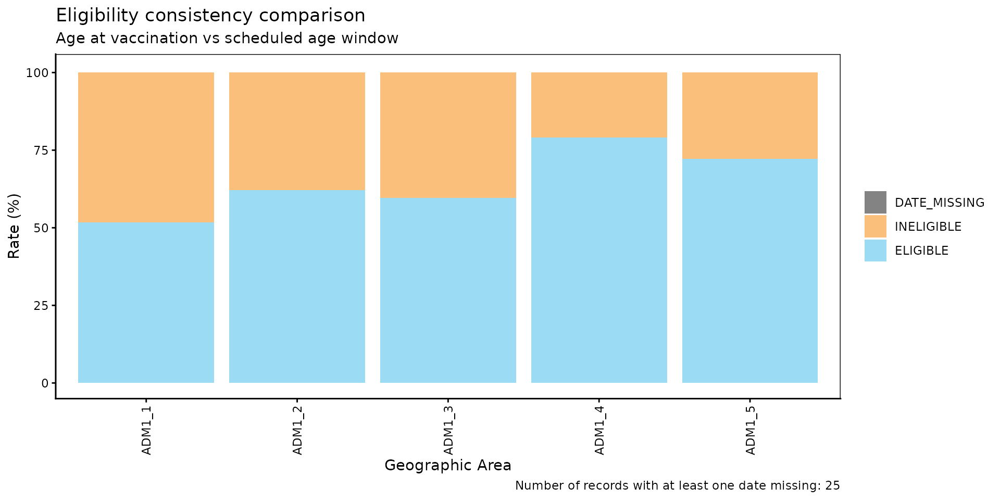
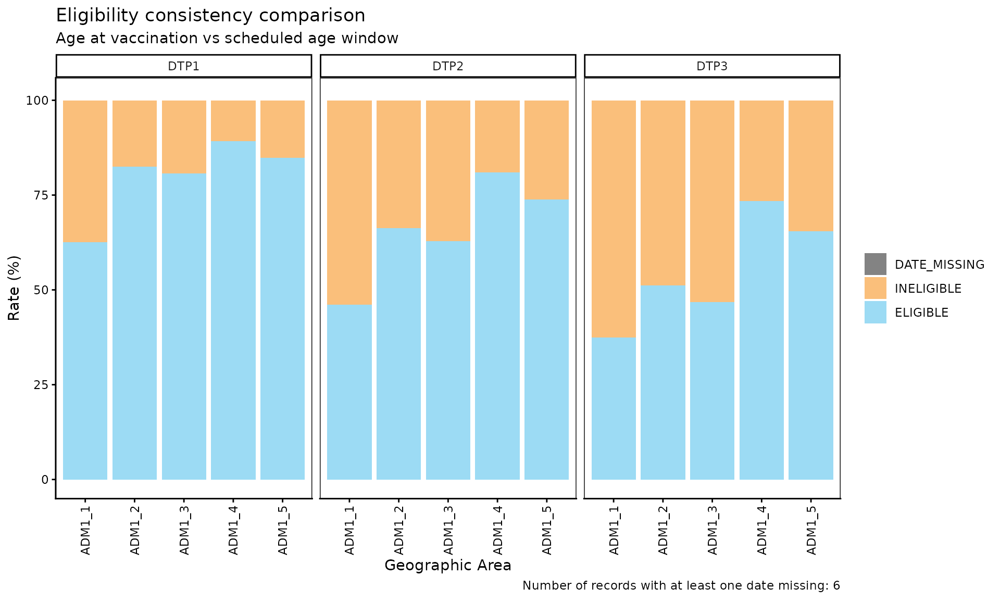
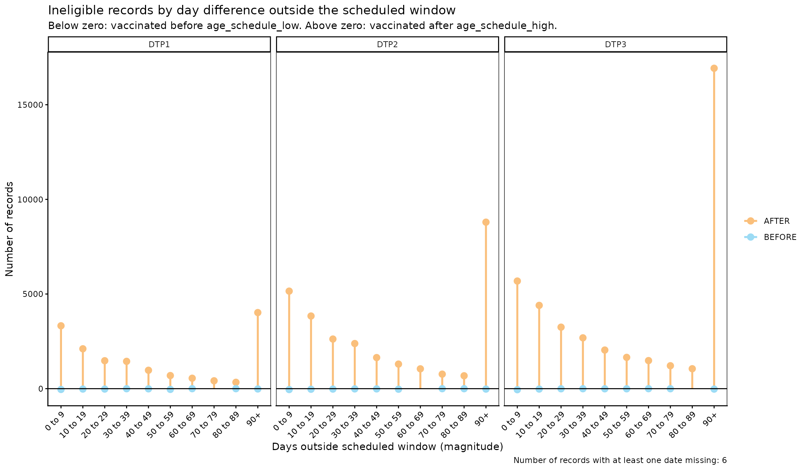
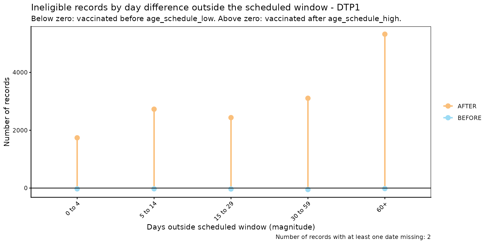

# Comparación de consistencia de elegibilidad

[🌐 Read this in
English](https://im-data-paho.github.io/pahoabc/articles/en/eligibility_consistency_comparison_en.md)

## Fundamento

Los esquemas nacionales de vacunación definen, para cada dosis, una
ventana de edad objetivo durante la cual se espera que la persona sea
vacunada (p. ej., la DTP1 debería administrarse entre los 54 y los 90
días de edad). Un evento de vacunación que ocurre fuera de esa ventana —
demasiado temprano o demasiado tarde — indica un problema de calidad de
datos o una brecha programática en la oportunidad de la prestación del
servicio.

El módulo de comparación de consistencia de elegibilidad permite
identificar, cuantificar y visualizar de forma sistemática si la edad al
momento de la vacunación (`date_vax - date_birth`) se encuentra dentro
de la ventana de edad definida por el esquema de vacunación
(`age_schedule_low`, `age_schedule_high`).

> **Nota**
>
> Todas las funciones utilizadas para los análisis de comparación de
> consistencia de elegibilidad dentro de PAHOabc comienzan con el
> prefijo `ecc_`.

> **Advertencia**
>
> Las funciones `ecc_` calculan la edad al momento de la vacunación como
> `date_vax - date_birth`. Si `data.EIR` contiene registros donde
> `date_vax` ocurre antes que `date_birth` (es decir, una edad de
> vacunación negativa), esto señala un error de **consistencia de
> fechas**, no de elegibilidad. Cuando esto ocurre, las funciones `ecc_`
> emiten una advertencia que remite al [módulo `dcc_` de comparación de
> consistencia de
> fechas](https://im-data-paho.github.io/pahoabc/articles/es/date_consistency_comparison_es.md)
> para identificar y resolver esos registros primero.

## Glosario

### Divisiones político-geográficas

A lo largo de esta viñeta se hace referencia a distintos niveles de
división político-geográfica. Estos niveles son definidos por cada país
o territorio y pueden recibir nombres diferentes. PAHOabc no depende de
esos nombres locales; por eso, el usuario debe recodificar sus variables
para ajustarlas a la estructura que utiliza el paquete.

En concreto, PAHOabc puede distinguir tres niveles administrativos que,
listados del nivel superior al inferior, son: ADM0, ADM1 y ADM2.

1.  ADM0: El país. Este es el nivel administrativo más alto.
2.  ADM1: La primera subdivisión geográfica del país. ADM0 contiene
    varias subdivisiones ADM1.
3.  ADM2: La segunda subdivisión geográfica del país. Cada ADM1 contiene
    varias subdivisiones ADM2.

### Categorías de elegibilidad

| Categoría | Significado |
|----|----|
| `ELIGIBLE` | La edad al momento de la vacunación está dentro de `[age_schedule_low, age_schedule_high]`. |
| `INELIGIBLE` | La edad al momento de la vacunación está fuera de `[age_schedule_low, age_schedule_high]` — vacunación demasiado temprana o demasiado tardía. |
| `DATE_MISSING` | `date_vax` o `date_birth` es `NA`. |

## Uso

### Instalar el paquete

``` r

devtools::install_github("IM-Data-PAHO/pahoabc")
```

### Cargar los datos

Las funciones de este módulo requieren su **RNVe** y un **esquema de
vacunación**, ambos en el formato estándar de PAHOabc.

#### RNVe

El conjunto de datos
[`pahoabc::pahoabc.EIR`](https://im-data-paho.github.io/pahoabc/reference/pahoabc.EIR.md)
proporciona una tabla nominal simulada con eventos individuales de
vacunación de un Registro Nominal de Vacunación electrónico (RNVe). Cada
fila corresponde a una vacunación de una persona.

``` r

pahoabc.EIR %>% head() %>% kable(caption = "Ejemplo de Registro Nominal de Vacunación electrónico")
```

| ID | date_birth | date_vax | ADM1_residence | ADM2_residence | ADM1_occurrence | ADM2_occurrence | dose |
|---:|:---|:---|:---|:---|:---|:---|:---|
| 191997 | 2023-08-08 | 2023-12-26 | ADM1_4 | ADM2_4_35 | ADM1_4 | ADM2_4_35 | DTP2 |
| 212189 | 2023-12-20 | 2023-12-26 | ADM1_5 | ADM2_5_61 | ADM1_5 | ADM2_5_61 | BCG RN |
| 118063 | 2022-09-15 | 2023-12-26 | ADM1_2 | ADM2_2_5 | ADM1_2 | ADM2_2_5 | DTP1 |
| 118063 | 2022-09-15 | 2023-12-26 | ADM1_2 | ADM2_2_5 | ADM1_2 | ADM2_2_5 | YFV1 |
| 130751 | 2022-10-27 | 2023-12-12 | ADM1_5 | ADM2_5_55 | ADM1_5 | ADM2_5_55 | YFV1 |
| 136532 | 2021-09-21 | 2023-12-26 | ADM1_3 | ADM2_3_12 | ADM1_3 | ADM2_3_12 | SRP1 |

Ejemplo de Registro Nominal de Vacunación electrónico {.table
style="width:100%;"}

- `ID`: Número único de identificación de la persona.
- Fecha de nacimiento (`date_birth`): Fecha de nacimiento de la persona.
- Fecha de vacunación (`date_vax`): Fecha del evento de vacunación.
- `ADM1_residence` / `ADM2_residence`: Primer y segundo nivel
  administrativo geográfico de residencia.
- Dosis (`dose`): Variable combinada que representa el tipo de vacuna y
  su número de dosis correspondiente (p. ej., DTP1).

#### Esquema de vacunación

El conjunto de datos
[`pahoabc::pahoabc.schedule`](https://im-data-paho.github.io/pahoabc/reference/pahoabc.schedule.md)
define el esquema nacional de vacunación, indicando para cada dosis la
ventana de edad objetivo para su administración, en días.

``` r

pahoabc.schedule %>% kable(caption = "Ejemplo de esquema de vacunación")
```

| dose   | age_schedule | age_schedule_low | age_schedule_high |
|:-------|-------------:|-----------------:|------------------:|
| SRP1   |          365 |              360 |               420 |
| DTP1   |           60 |               54 |                90 |
| DTP2   |          120 |              116 |               150 |
| DTP3   |          180 |              176 |               210 |
| BCG RN |            0 |                0 |                28 |
| YFV1   |          365 |              360 |               420 |

Ejemplo de esquema de vacunación {.table}

- Dosis (`dose`): Variable combinada que representa el tipo de vacuna y
  su número de dosis.
- `age_schedule`: La edad recomendada de administración de la `dose`
  correspondiente, en días.
- `age_schedule_low`: El límite inferior de la ventana de edad objetivo,
  en días.
- `age_schedule_high`: El límite superior de la ventana de edad
  objetivo, en días.

### Análisis de comparación de consistencia de elegibilidad

#### Flujo de trabajo esperado

El conjunto de funciones `ecc_` contiene cuatro funciones que trabajan
en conjunto:

1.  [`ecc_rate()`](https://im-data-paho.github.io/pahoabc/reference/ecc_rate.md)
    — calcula las tasas de elegibilidad, opcionalmente desagregadas por
    dosis y nivel geográfico.
2.  [`ecc_barplot()`](https://im-data-paho.github.io/pahoabc/reference/ecc_barplot.md)
    — visualiza el resultado de
    [`ecc_rate()`](https://im-data-paho.github.io/pahoabc/reference/ecc_rate.md)
    como un gráfico de barras apiladas.
3.  [`ecc_inconsistent()`](https://im-data-paho.github.io/pahoabc/reference/ecc_inconsistent.md)
    — lista los registros inelegibles e incompletos de forma individual,
    con su diferencia en días respecto a la ventana programada.
4.  [`ecc_inconsistent_plot()`](https://im-data-paho.github.io/pahoabc/reference/ecc_inconsistent_plot.md)
    — visualiza la distribución de esas diferencias en días como un
    gráfico de líneas divergente (*lollipop*).

La figura a continuación muestra el flujo de trabajo esperado.


Figura 1. Flujo de trabajo esperado para el análisis de comparación de
consistencia de elegibilidad.

  

#### Paso 1 — Calcular las tasas de elegibilidad con `ecc_rate()`

[`ecc_rate()`](https://im-data-paho.github.io/pahoabc/reference/ecc_rate.md)
compara la edad al momento de la vacunación con la ventana de edad
programada y devuelve el conteo y el porcentaje de registros
clasificados como `ELIGIBLE`, `INELIGIBLE` o `DATE_MISSING`.

Por defecto, `vaccines = NULL` agrupa todas las dosis de `data.schedule`
en conjunto. Aquí calculamos las tasas agrupadas a nivel ADM1.

``` r

rate_df <- ecc_rate(
  data.EIR      = pahoabc.EIR,
  data.schedule = pahoabc.schedule,
  geo_level     = "ADM1"
)
```

    ## Warning in .validate_age_at_vax(prepare_EIR): Warning: 241 record(s) show a
    ## negative age at vaccination, meaning they were vaccinated before they were
    ## born. This indicates date consistency errors in data.EIR. Please check the
    ## (D)ate (C)onsistency (C)omparison dcc_ module (dcc_rate, dcc_inconsistent) to
    ## identify and resolve these records.

``` r

rate_df %>% kable(digits = 2, caption = "Tasas de elegibilidad agrupadas por ADM1")
```

| ADM1   | eligibility  |      n |  total |  rate |
|:-------|:-------------|-------:|-------:|------:|
| ADM1_1 | DATE_MISSING |      2 |  14058 |  0.01 |
| ADM1_1 | ELIGIBLE     |   7280 |  14058 | 51.79 |
| ADM1_1 | INELIGIBLE   |   6776 |  14058 | 48.20 |
| ADM1_2 | ELIGIBLE     |  46700 |  75165 | 62.13 |
| ADM1_2 | INELIGIBLE   |  28465 |  75165 | 37.87 |
| ADM1_3 | DATE_MISSING |     22 | 333038 |  0.01 |
| ADM1_3 | ELIGIBLE     | 198681 | 333038 | 59.66 |
| ADM1_3 | INELIGIBLE   | 134335 | 333038 | 40.34 |
| ADM1_4 | DATE_MISSING |      1 |  45830 |  0.00 |
| ADM1_4 | ELIGIBLE     |  36247 |  45830 | 79.09 |
| ADM1_4 | INELIGIBLE   |   9582 |  45830 | 20.91 |
| ADM1_5 | ELIGIBLE     |  17748 |  24597 | 72.16 |
| ADM1_5 | INELIGIBLE   |   6849 |  24597 | 27.84 |

Tasas de elegibilidad agrupadas por ADM1 {.table}

Al especificar `vaccines`, los resultados se desagregan por `dose`, un
conjunto de filas por vacuna:

``` r

rate_by_dose_df <- ecc_rate(
  data.EIR      = pahoabc.EIR,
  data.schedule = pahoabc.schedule,
  geo_level     = "ADM1",
  vaccines      = c("DTP1", "DTP2", "DTP3")
)
```

    ## Warning in .validate_age_at_vax(prepare_EIR): Warning: 37 record(s) show a
    ## negative age at vaccination, meaning they were vaccinated before they were
    ## born. This indicates date consistency errors in data.EIR. Please check the
    ## (D)ate (C)onsistency (C)omparison dcc_ module (dcc_rate, dcc_inconsistent) to
    ## identify and resolve these records.

``` r

rate_by_dose_df %>% head(10) %>% kable(digits = 2, caption = "Tasas de elegibilidad por dosis y ADM1")
```

| dose | ADM1   | eligibility  |     n | total |  rate |
|:-----|:-------|:-------------|------:|------:|------:|
| DTP1 | ADM1_1 | ELIGIBLE     |  1647 |  2629 | 62.65 |
| DTP1 | ADM1_1 | INELIGIBLE   |   982 |  2629 | 37.35 |
| DTP1 | ADM1_2 | ELIGIBLE     | 10401 | 12606 | 82.51 |
| DTP1 | ADM1_2 | INELIGIBLE   |  2205 | 12606 | 17.49 |
| DTP1 | ADM1_3 | DATE_MISSING |     2 | 56340 |  0.00 |
| DTP1 | ADM1_3 | ELIGIBLE     | 45482 | 56340 | 80.73 |
| DTP1 | ADM1_3 | INELIGIBLE   | 10856 | 56340 | 19.27 |
| DTP1 | ADM1_4 | ELIGIBLE     |  6864 |  7690 | 89.26 |
| DTP1 | ADM1_4 | INELIGIBLE   |   826 |  7690 | 10.74 |
| DTP1 | ADM1_5 | ELIGIBLE     |  3472 |  4091 | 84.87 |

Tasas de elegibilidad por dosis y ADM1 {.table}

##### Parámetros aceptados

- `data.EIR`: Tabla del RNVe en formato PAHOabc.
- `data.schedule`: Tabla del esquema de vacunación en formato PAHOabc.
- `geo_level`: `"ADM0"` (predeterminado), `"ADM1"` o `"ADM2"`.
- `vaccines`: Vector de caracteres con las dosis a incluir, desagregando
  por `dose`. El valor predeterminado `NULL` agrupa todas las dosis de
  `data.schedule`.

#### Paso 2 — Visualizar las tasas con `ecc_barplot()`

El resultado de
[`ecc_rate()`](https://im-data-paho.github.io/pahoabc/reference/ecc_rate.md)
puede pasarse directamente a
[`ecc_barplot()`](https://im-data-paho.github.io/pahoabc/reference/ecc_barplot.md)
para producir un gráfico de barras apiladas. Si `data` está desagregado
por `dose`, el gráfico se organiza automáticamente en paneles (*facets*)
por dosis.

``` r

ecc_barplot(data = rate_df)
```



``` r

ecc_barplot(data = rate_by_dose_df)
```



##### Parámetros aceptados

- `data`: Resultado de
  [`ecc_rate()`](https://im-data-paho.github.io/pahoabc/reference/ecc_rate.md).
- `within_ADM1`: Vector de caracteres para filtrar unidades ADM1
  específicas cuando `geo_level = "ADM2"`. Valor predeterminado: `NULL`.
- `plot_missing`: Booleano. Si es `TRUE` (predeterminado), los registros
  `DATE_MISSING` se muestran como un segmento separado para que todas
  las barras sumen 100 %.

##### Interpretación

Cada barra representa una unidad geográfica y se divide en segmentos:
`ELIGIBLE` (azul), `INELIGIBLE` (naranja) y `DATE_MISSING` (gris). Las
barras con predominio de naranja indican unidades donde una parte
importante de las dosis se administran fuera de la ventana de edad
recomendada — una señal que amerita investigar la oportunidad en la
prestación del servicio.

#### Paso 3 — Inspeccionar los registros inelegibles con `ecc_inconsistent()`

[`ecc_inconsistent()`](https://im-data-paho.github.io/pahoabc/reference/ecc_inconsistent.md)
devuelve una tabla a nivel de registro con todas las entradas
`INELIGIBLE` y `DATE_MISSING`, incluyendo el número de días fuera de la
ventana programada.

``` r

inconsistent_df <- ecc_inconsistent(
  data.EIR      = pahoabc.EIR,
  data.schedule = pahoabc.schedule,
  vaccines      = "DTP1"
)
```

    ## Warning in .validate_age_at_vax(prepare_EIR): Warning: 19 record(s) show a
    ## negative age at vaccination, meaning they were vaccinated before they were
    ## born. This indicates date consistency errors in data.EIR. Please check the
    ## (D)ate (C)onsistency (C)omparison dcc_ module (dcc_rate, dcc_inconsistent) to
    ## identify and resolve these records.

``` r

inconsistent_df %>% head(10) %>% kable(caption = "Muestra de registros inelegibles e incompletos de DTP1")
```

| ID | dose | date_birth | date_vax | age_at_vax | age_schedule_low | age_schedule_high | days_outside_range | eligibility |
|---:|:---|:---|:---|---:|---:|---:|---:|:---|
| 118063 | DTP1 | 2022-09-15 | 2023-12-26 | 467 | 54 | 90 | 377 | INELIGIBLE |
| 187807 | DTP1 | 2023-07-19 | 2023-12-26 | 160 | 54 | 90 | 70 | INELIGIBLE |
| 212197 | DTP1 | 2022-10-23 | 2023-12-19 | 422 | 54 | 90 | 332 | INELIGIBLE |
| 101916 | DTP1 | 2021-10-21 | 2022-01-24 | 95 | 54 | 90 | 5 | INELIGIBLE |
| 120150 | DTP1 | 2022-04-21 | 2022-08-23 | 124 | 54 | 90 | 34 | INELIGIBLE |
| 61279 | DTP1 | 2022-01-11 | 2022-04-18 | 97 | 54 | 90 | 7 | INELIGIBLE |
| 205838 | DTP1 | 2023-08-04 | 2023-12-28 | 146 | 54 | 90 | 56 | INELIGIBLE |
| 15488 | DTP1 | 2020-06-15 | 2022-02-23 | 618 | 54 | 90 | 528 | INELIGIBLE |
| 61972 | DTP1 | 2022-03-21 | 2022-06-20 | 91 | 54 | 90 | 1 | INELIGIBLE |
| 90337 | DTP1 | 2022-03-18 | 2022-06-20 | 94 | 54 | 90 | 4 | INELIGIBLE |

Muestra de registros inelegibles e incompletos de DTP1 {.table}

##### Parámetros aceptados

- `data.EIR`: Tabla del RNVe en formato PAHOabc.
- `data.schedule`: Tabla del esquema de vacunación en formato PAHOabc.
- `vaccines`: Vector de caracteres con las dosis a incluir. El valor
  predeterminado `NULL` incluye todas las dosis de `data.schedule`.

La columna `days_outside_range` es negativa cuando la persona fue
vacunada antes de `age_schedule_low`, y positiva cuando fue vacunada
después de `age_schedule_high` (`NA` cuando falta una fecha). Esta tabla
puede exportarse para flujos de corrección a nivel de registro.

#### Paso 4 — Visualizar la distribución de las diferencias en días con `ecc_inconsistent_plot()`

[`ecc_inconsistent_plot()`](https://im-data-paho.github.io/pahoabc/reference/ecc_inconsistent_plot.md)
produce un gráfico de líneas divergente (*lollipop*) de los registros
inelegibles, agrupados por la **magnitud** de los días fuera de la
ventana programada. Los mismos intervalos se comparten entre ambas
direcciones: los registros vacunados demasiado temprano se grafican
debajo de cero, y los vacunados demasiado tarde se grafican encima de
cero.

``` r

ecc_inconsistent_plot(
  data.EIR      = pahoabc.EIR,
  data.schedule = pahoabc.schedule,
  vaccines      = "DTP1"
)
```

    ## Warning in .validate_age_at_vax(prepare_EIR): Warning: 19 record(s) show a
    ## negative age at vaccination, meaning they were vaccinated before they were
    ## born. This indicates date consistency errors in data.EIR. Please check the
    ## (D)ate (C)onsistency (C)omparison dcc_ module (dcc_rate, dcc_inconsistent) to
    ## identify and resolve these records.


Cuando se especifica más de una vacuna, el gráfico se organiza
automáticamente en paneles por dosis:

``` r

ecc_inconsistent_plot(
  data.EIR      = pahoabc.EIR,
  data.schedule = pahoabc.schedule,
  vaccines      = c("DTP1", "DTP2", "DTP3")
)
```

    ## Warning in .validate_age_at_vax(prepare_EIR): Warning: 37 record(s) show a
    ## negative age at vaccination, meaning they were vaccinated before they were
    ## born. This indicates date consistency errors in data.EIR. Please check the
    ## (D)ate (C)onsistency (C)omparison dcc_ module (dcc_rate, dcc_inconsistent) to
    ## identify and resolve these records.



##### Parámetros aceptados

- `data.EIR`: Tabla del RNVe en formato PAHOabc.
- `data.schedule`: Tabla del esquema de vacunación en formato PAHOabc.
- `vaccines`: Vector de caracteres con las dosis a incluir, organizando
  el gráfico en paneles por `dose` cuando se especifica más de una. El
  valor predeterminado `NULL` agrupa todas las dosis de `data.schedule`
  (sin paneles).
- `day_groups`: Lista de pares numéricos `c(inferior, superior)` que
  definen los intervalos de magnitud compartidos por ambas direcciones.
  El último intervalo siempre se extiende hasta `Inf` y se etiqueta como
  `"X+"`. Valor predeterminado: intervalos de 10 días de 0 a 100.

Para usar intervalos personalizados — por ejemplo, mayor resolución para
diferencias pequeñas:

``` r

ecc_inconsistent_plot(
  data.EIR      = pahoabc.EIR,
  data.schedule = pahoabc.schedule,
  vaccines      = "DTP1",
  day_groups    = list(c(0, 5), c(5, 15), c(15, 30), c(30, 60), c(60, 120))
)
```

    ## Warning in .validate_age_at_vax(prepare_EIR): Warning: 19 record(s) show a
    ## negative age at vaccination, meaning they were vaccinated before they were
    ## born. This indicates date consistency errors in data.EIR. Please check the
    ## (D)ate (C)onsistency (C)omparison dcc_ module (dcc_rate, dcc_inconsistent) to
    ## identify and resolve these records.



##### Interpretación

El eje horizontal muestra la magnitud de los días fuera de la ventana
programada, compartida por ambas direcciones. Los puntos debajo de cero
representan registros vacunados demasiado temprano (antes de
`age_schedule_low`); los puntos encima de cero representan registros
vacunados demasiado tarde (después de `age_schedule_high`). Los
intervalos con grandes conteos de vacunación tardía suelen señalar
retrasos programáticos en la prestación del servicio, mientras que los
conteos de vacunación temprana pueden señalar errores de captura de
datos o campañas de vacunación fuera de calendario.

## Resumen

El módulo `ecc_` ofrece una cadena completa de análisis para evaluar la
consistencia de elegibilidad en datos del RNVe. Partiendo de
[`ecc_rate()`](https://im-data-paho.github.io/pahoabc/reference/ecc_rate.md)
para una visión general geográfica y por dosis, pasando por
[`ecc_barplot()`](https://im-data-paho.github.io/pahoabc/reference/ecc_barplot.md)
para la visualización, hasta
[`ecc_inconsistent()`](https://im-data-paho.github.io/pahoabc/reference/ecc_inconsistent.md)
para la inspección a nivel de registro y
[`ecc_inconsistent_plot()`](https://im-data-paho.github.io/pahoabc/reference/ecc_inconsistent_plot.md)
para caracterizar la magnitud y dirección de los errores de oportunidad,
el conjunto de funciones provee a los gestores de datos y analistas de
salud pública las herramientas necesarias para detectar, cuantificar y
priorizar problemas de oportunidad en la prestación del servicio.
