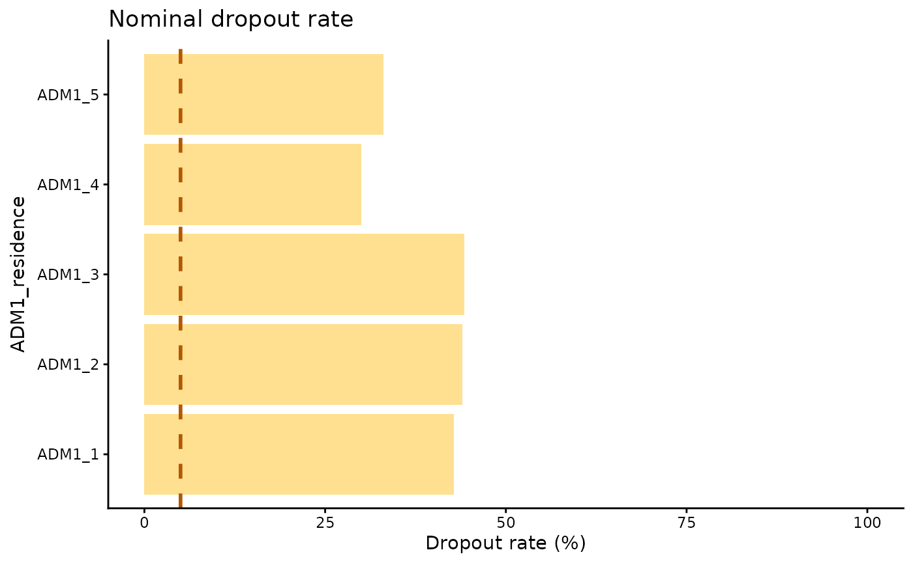

# Tasa de abandono nominal

[🌐 Read this in
English](https://im-data-paho.github.io/pahoabc/articles/en/nominal_dropout_en.md)

## Fundamento

La tasa de abandono es un indicador que se utiliza para evaluar la
pérdida de seguimiento en los esquemas de vacunación. Muestra el
porcentaje de personas que recibieron una dosis inicial (por ejemplo,
DTP1), pero no recibieron una dosis posterior o final (por ejemplo,
DTP3). En los sistemas agregados, se estima mediante la siguiente
fórmula:

``` math
\text{Tasa de abandono (\%)} =
\frac{\text{dosis de DTP1 administradas} - \text{dosis de DTP3 administradas}}{\text{dosis de DTP1 administradas}} \times 100
```

El análisis con datos agregados no permite confirmar que las personas
que recibieron ambas dosis sean las mismas, como se muestra en la Figura
1A. Los registros nominales electrónicos de vacunación permiten hacer el
análisis persona por persona y confirmar si quienes recibieron la
primera dosis también recibieron la dosis de seguimiento, como se
ilustra en la Figura 1B.


Figura 1. Representación visual de un análisis de abandono nominal.

  

> **Nota**
>
> Todas las funciones utilizadas para los análisis de abandono nominal
> dentro de PAHOabc comienzan con el prefijo `nod_`.

## Glosario

### Divisiones político-geográficas

A lo largo de esta viñeta se hace referencia a distintos niveles de
división político-geográfica. Estos niveles son definidos por cada país
o territorio y pueden recibir nombres diferentes. PAHOabc no depende de
esos nombres locales; por eso, el usuario debe recodificar sus variables
para ajustarlas a la estructura que utiliza el paquete.

En concreto, PAHOabc puede distinguir tres niveles administrativos que,
listados del nivel superior al inferior, son: ADM0, ADM1 y ADM2.

1.  ADM0: El país. Este es el nivel administrativo más alto.
2.  ADM1: La primera subdivisión geográfica del país. ADM0 contiene
    varias subdivisiones ADM1.
3.  ADM2: La segunda subdivisión geográfica del país. Cada ADM1 contiene
    varias subdivisiones ADM2.

### Nombres de vacunas

Los conjuntos de datos de ejemplo utilizan una convención específica
para nombrar las dosis de vacunas. Es posible que esta convención no
coincida con la que usa su país o institución, pero esto no afecta el
uso del paquete si los nombres se aplican de manera consistente.

Por ejemplo, los nombres de las vacunas utilizados en el paquete PAHOabc
son:

| Abreviatura | Nombre completo                                          |
|-------------|----------------------------------------------------------|
| SRP1        | Vacuna contra sarampión, rubéola y paperas (1.ª dosis)   |
| DTP1        | Vacuna contra difteria, tétanos y tos ferina (1.ª dosis) |
| DTP2        | Vacuna contra difteria, tétanos y tos ferina (2.ª dosis) |
| DTP3        | Vacuna contra difteria, tétanos y tos ferina (3.ª dosis) |
| BCG RN      | Vacuna Bacillus Calmette–Guérin (al nacer)               |
| YFV1        | Vacuna contra la fiebre amarilla (1.ª dosis)             |

## Uso

### Instalar el paquete

El primer paso para ejecutar el análisis de tasa de abandono nominal es
instalar el paquete PAHOabc, disponible en GitHub.

``` r

devtools::install_github("IM-Data-PAHO/pahoabc")
```

### Cargar los datos

Las funciones de este módulo requieren que proporcione su **RNVe** en un
formato específico.

Para facilitar la prueba de PAHOabc y la comprensión de la estructura
requerida, a continuación se presenta el conjunto de datos de ejemplo
que utiliza este módulo.

#### RNVe

El conjunto de datos
[`pahoabc::pahoabc.EIR`](https://im-data-paho.github.io/pahoabc/reference/pahoabc.EIR.md)
proporciona un ejemplo de Registro Nominal de Vacunación electrónico
(RNVe). Es una tabla nominal simulada con eventos individuales de
vacunación. Cada fila corresponde a una vacunación e incluye información
sobre la residencia de la persona, el lugar donde fue vacunada
(ocurrencia), su fecha de nacimiento y la dosis recibida.

``` r

pahoabc.EIR %>% head() %>% kable(caption = "Ejemplo de Registro Nominal de Vacunación electrónico")
```

| ID | date_birth | date_vax | ADM1_residence | ADM2_residence | ADM1_occurrence | ADM2_occurrence | dose |
|---:|:---|:---|:---|:---|:---|:---|:---|
| 191997 | 2023-08-08 | 2023-12-26 | ADM1_4 | ADM2_4_35 | ADM1_4 | ADM2_4_35 | DTP2 |
| 212189 | 2023-12-20 | 2023-12-26 | ADM1_5 | ADM2_5_61 | ADM1_5 | ADM2_5_61 | BCG RN |
| 118063 | 2022-09-15 | 2023-12-26 | ADM1_2 | ADM2_2_5 | ADM1_2 | ADM2_2_5 | DTP1 |
| 118063 | 2022-09-15 | 2023-12-26 | ADM1_2 | ADM2_2_5 | ADM1_2 | ADM2_2_5 | YFV1 |
| 130751 | 2022-10-27 | 2023-12-12 | ADM1_5 | ADM2_5_55 | ADM1_5 | ADM2_5_55 | YFV1 |
| 136532 | 2021-09-21 | 2023-12-26 | ADM1_3 | ADM2_3_12 | ADM1_3 | ADM2_3_12 | SRP1 |

Ejemplo de Registro Nominal de Vacunación electrónico {.table
style="width:100%;"}

- `ID`: Número único de identificación de la persona.
- Fecha de nacimiento (`date_birth`): Fecha de nacimiento de la persona.
- Fecha de vacunación (`date_vax`): Fecha del evento de vacunación.
- ADM1: Primer nivel administrativo geográfico del país.
- ADM2: Segundo nivel administrativo geográfico del país.
- Lugar de residencia (`Residence`): Lugar donde vive la persona.
- Lugar de vacunación (`Occurrence`): Lugar donde ocurrió la vacunación.
- Dosis (`dose`): Variable combinada que representa el tipo de vacuna y
  su número de dosis correspondiente. Por ejemplo, DTP1 se refiere a la
  primera dosis de una vacuna que contiene componentes de difteria,
  tétanos y tos ferina.

### Análisis de abandono nominal

PAHOabc permite estimar la tasa de abandono nominal persona por persona.
El análisis puede aplicarse a cualquier par de dosis, siempre que se
indique una dosis inicial y una dosis final. Para interpretar
correctamente los resultados, la dosis inicial debe preceder a la dosis
final en el esquema de vacunación; por ejemplo, DTP1-DTP3 o DTP1-MCV1.
Además, el usuario puede seleccionar el nivel de agregación de los
resultados: nacional, ADM1 o ADM2.

#### Flujo de trabajo esperado

Las funciones
[`nod_dropout()`](https://im-data-paho.github.io/pahoabc/reference/nod_dropout.md)
y
[`nod_barplot()`](https://im-data-paho.github.io/pahoabc/reference/nod_barplot.md)
trabajan en conjunto para analizar y visualizar el abandono nominal. La
función
[`nod_dropout()`](https://im-data-paho.github.io/pahoabc/reference/nod_dropout.md)
calcula el abandono nominal y los casos completos por residencia, según
los niveles administrativos, cohortes de nacimiento y vacunas
seleccionados. Su resultado es una tabla compatible con
[`nod_barplot()`](https://im-data-paho.github.io/pahoabc/reference/nod_barplot.md),
que genera la visualización correspondiente.


Figura 2. Flujo de trabajo esperado para el análisis de tasa de abandono
nominal.

  

#### Ejemplo

A continuación se muestra un caso de uso sencillo de
[`nod_dropout()`](https://im-data-paho.github.io/pahoabc/reference/nod_dropout.md),
en el que se calcula el abandono nominal entre DTP1 y DTP3 a nivel ADM1
usando el conjunto de datos de ejemplo.

``` r

# Ejecuta la función de abandono nominal
example_dropout <- nod_dropout(data.EIR = pahoabc.EIR,
                               vaccine_init = "DTP1", #Vacuna inicial según su conjunto de datos
                               vaccine_end= "DTP3", #Vacuna final según su conjunto de datos
                               geo_level = "ADM1", #Puede ser ADM0, ADM1 o ADM2
                               birth_cohorts = NULL #Puede ser un vector de años o un año
                               )

# mostrar los resultados en una tabla
example_dropout %>%
  kable(digits = 3, caption = "Tasa de abandono nominal entre DTP1 y DTP3 a nivel ADM1")
```

| ADM1_residence | indicator |   num | denom | percent |
|:---------------|:----------|------:|------:|--------:|
| ADM1_1         | complete  |  1491 |  2607 |  57.192 |
| ADM1_1         | dropout   |  1116 |  2607 |  42.808 |
| ADM1_2         | complete  |  6967 | 12429 |  56.054 |
| ADM1_2         | dropout   |  5462 | 12429 |  43.946 |
| ADM1_3         | complete  | 30999 | 55608 |  55.746 |
| ADM1_3         | dropout   | 24609 | 55608 |  44.254 |
| ADM1_4         | complete  |  5304 |  7574 |  70.029 |
| ADM1_4         | dropout   |  2270 |  7574 |  29.971 |
| ADM1_5         | complete  |  2703 |  4040 |  66.906 |
| ADM1_5         | dropout   |  1337 |  4040 |  33.094 |

Tasa de abandono nominal entre DTP1 y DTP3 a nivel ADM1 {.table}

##### Parámetros aceptados

- `data.EIR`: Tabla del RNVe estructurada con las variables listadas
  anteriormente.  
- `vaccine_init`: Nombre de la vacuna que se usará como punto de inicio
  del análisis, tal como aparece en la columna de dosis (**dose**).  
- `vaccine_end`: Nombre de la vacuna que se usará como punto final del
  análisis, tal como aparece en la columna de dosis (**dose**).  
- `geo_level`: Nivel administrativo que se usará en el análisis. Es un
  parámetro opcional y puede tomar los valores “ADM0”, “ADM1” o “ADM2”.
  Si se omite, el valor predeterminado es “ADM0”.
- `birth_cohorts`: Parámetro para segmentar el análisis según el año de
  nacimiento de las personas. Se basa en la columna de fecha de
  nacimiento (`date_birth`) y puede recibir un año o un vector de años.

Los parámetros `data.EIR`, `vaccine_init` y `vaccine_end` son
obligatorios. `geo_level` y `birth_cohorts` son opcionales y permiten
segmentar los datos para análisis más precisos.

Consulte la documentación de la función con `?nod_dropout()` en R para
obtener más información.

Esta salida puede pasarse directamente a la función
[`nod_barplot()`](https://im-data-paho.github.io/pahoabc/reference/nod_barplot.md)
como se muestra a continuación.

``` r

# Ejecuta la función nod_barplot
example_dropout_plot <- nod_barplot(data=example_dropout, order="alpha")

#mostrar el gráfico
example_dropout_plot
```



##### Parámetros aceptados

La función
[`nod_barplot()`](https://im-data-paho.github.io/pahoabc/reference/nod_barplot.md)
acepta los siguientes parámetros:

- `data`: Tabla generada a partir del resultado de la función
  [`nod_dropout()`](https://im-data-paho.github.io/pahoabc/reference/nod_dropout.md).
- `order`: Organiza las barras según tres opciones: alfabético
  (“alpha”), descendente (“desc”) o ascendente (“asc”); el valor
  predeterminado es “alpha”.
- `within_ADM1`: Permite filtrar dentro de un ADM1 y mostrar únicamente
  los datos ADM2 correspondientes al ADM1 especificado.

##### Interpretación

Este gráfico muestra el abandono nominal por nivel administrativo 1 e
incluye una línea de 5 % como umbral de referencia. Una tasa de abandono
alta significa que una proporción importante de las personas analizadas
no recibió la dosis de seguimiento de su esquema. En un esquema de
múltiples dosis, lo esperado es que toda persona que recibe una dosis
inicial regrese para recibir la dosis siguiente. En este ejemplo,
**ADM1_1** presenta el peor resultado, mientras que **ADM1_4** presenta
el mejor.

Todas las unidades administrativas tienen una tasa de abandono nominal
superior al **25 %**. Esto significa que al menos el 25 % de las
personas de ese grupo objetivo **no regresó para recibir la dosis de
seguimiento**.

## Resumen

Monitorear la continuidad en los esquemas de vacunación de múltiples
dosis es fundamental para los programas de inmunización. La *tasa de
abandono nominal* es la proporción de personas que inician una serie
(por ejemplo, DTP1), pero no reciben la dosis final o de seguimiento
(por ejemplo, DTP3). Este indicador ofrece una mirada persona por
persona del desempeño del programa, algo que los conteos agregados no
permiten observar.

Esta viñeta presenta un flujo de trabajo reproducible: instalar el
paquete, explorar el RNVe de ejemplo, calcular el abandono con
[`nod_dropout()`](https://im-data-paho.github.io/pahoabc/reference/nod_dropout.md)
y visualizar los resultados con
[`nod_barplot()`](https://im-data-paho.github.io/pahoabc/reference/nod_barplot.md).
El ejemplo estima el abandono entre DTP1 y DTP3 a nivel ADM1 y muestra
que todas las subdivisiones superan el umbral de 25 %; ADM1_1 presenta
el peor resultado y ADM1_4 el mejor, en relación con una línea de
referencia de 5 %.

Al combinar datos nominales del RNVe con un flujo de análisis claro,
PAHOabc ayuda a identificar pérdidas de seguimiento con desagregación
geográfica y apoya a las autoridades de salud en la focalización de
intervenciones.
