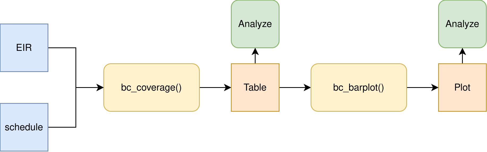

<a href="../es/birth_cohort_coverage_es.html" class="btn btn-outline-primary" role="button">🌐 Lea esto en español</a>

```{r setup, include = FALSE, message = FALSE, warning = FALSE}
library(pahoabc)
library(dplyr)
library(knitr)
```

# Rationale

The objective of this indicator is to monitor a specific birth cohort of newborns to determine their vaccination status and estimate the level of population protection against vaccine-preventable diseases. This analysis is essential for preventing the accumulation of susceptible individuals, maximizing herd immunity, and developing targeted vaccination strategies for those who have not received the necessary doses.

Vaccination coverage by birth cohort is calculated using the following formula:

$$
\text{Coverage by birth cohort (\%)} =
\frac{\text{# of people vaccinated in a specific birth cohort}}{\text{Total people in the specific birth cohort}} \times 100
$$

> **Note**
> 
> All functions used for birth cohort coverage analyses within PAHOabc begin with the `bc_` prefix.

# Glossary

## Birth Cohort

A birth cohort is the group of all individuals born within the same period of time, typically a single calendar year. For example, the 2022 birth cohort comprises everyone born during the year 2022.

## Political Geographic Boundaries

Throughout this vignette, we will make reference to different levels of political geographic boundaries. These levels are defined by the country/territory and can have different names from country to country. PAHOabc is agnostic to these names and requires the user to recode their variable names to fit the PAHOabc structure.

Namely, PAHOabc can distinguish three administrative levels, which listed from top to bottom level are: ADM0, ADM1 and ADM2.

1. ADM0: The country. This is the top-most administrative level.
2. ADM1: The first geographic subdivision in the country. ADM0 contains several ADM1 subdivisions.
3. ADM2: The second geographic subdivision in the country. Each ADM1 contains several ADM2 subdivisions.

## Vaccine Names

Our example datasets use a specific naming convention for the vaccine doses. This might not match your own naming schemes, but it will not affect the usage of the package as long as you make sure to be consistent when naming vaccine doses.

For example, the vaccine names used in the PAHOabc package are:

| Abbreviation | Full Name                                                        |
|--------------|------------------------------------------------------------------|
| SRP1         | Measles, Rubella, and Mumps Vaccine (1st dose)                   |
| DTP1         | Diphtheria, Tetanus, and Pertussis Vaccine (1st dose)            |
| DTP2         | Diphtheria, Tetanus, and Pertussis Vaccine (2nd dose)            |
| DTP3         | Diphtheria, Tetanus, and Pertussis Vaccine (3rd dose)            |
| BCG RN       | Bacillus Calmette–Guérin Vaccine (at birth)                      |
| YFV1         | Yellow Fever Vaccine (1st dose)                                  |

# Usage

## Install Package

The first step to run the birth cohort coverage analyses is to install the PAHOabc package available on GitHub.

```{r, install_package, eval=FALSE}
devtools::install_github("IM-Data-PAHO/pahoabc")
```

## Load Data

The functions in this module require you to provide three datasets in a specific format.

1. Your EIR.
2. The vaccination schedule related to this EIR.
3. Optionally, a table with population denominators at the same geographic level of disaggregation as your analysis.

To make it easy for you to test out PAHOabc's functionality and understand the structure we require for your datasets, we will now explore the example datasets provided by PAHOabc that are required by this module.

### EIR

The `pahoabc::pahoabc.EIR` data frame provides a simulated, nominal-level table representing individual vaccination events from an Electronic Immunization Registry (EIR). Each row corresponds to a single vaccination act for a person, including information on their residence, where they were vaccinated (occurrence), their date of birth, and the vaccine dose received.

```{r pahoabc-EIR, message=FALSE}
pahoabc.EIR %>% head() %>% kable(caption = "Example Electronic Immunization Registry")
```

- `ID`: Unique person identification number.
- `date_birth`: Date of birth of person. 
- `date_vax`: Date of vaccination event. 
- ADM1: Refers to the first geographic administrative level of the country.
- ADM2: Refers to the second geographic administrative level of the country.
- Residence: Refers to the place where the person lives.  
- Occurrence: Refers to the place where the vaccination event occurred.  
- `dose`: A combined variable representing the vaccine type and its corresponding dose number. For example, DTP1 refers to the first dose of a vaccine containing diphtheria, tetanus, and pertussis components.

### Vaccination Schedule

The `pahoabc::pahoabc.schedule` dataset defines the national immunization schedule, listing each vaccine dose and its recommended age of administration (in days). It helps the package determine whether an individual is up to date with their vaccinations.

```{r pahoabc-schedule, message=FALSE}
pahoabc.schedule %>% kable(caption = "Example Immunization Schedule")
```

- `dose`: A combined variable representing the vaccine type and its corresponding dose number. For example, DTP1 refers to the first dose of a vaccine containing diphtheria, tetanus, and pertussis components.
- `age_schedule`: The recommended age of administration of the corresponding `dose` in days.
- `age_schedule_low`: The lower limit for the target age in days.
- `age_schedule_high`: The upper limit for the target age in days.

> **Note**
> 
> The `dose` names must match exactly those in the `dose` column of the `pahoabc.EIR` dataset.

### Population Denominators

While not mandatory, this module lets you provide a population table to use as denominator for the coverage calculation. The geographic level of this table will be directly dependent on the geographic level of your analysis. For example, if you were to perform an analysis at ADM1 level, the required population denominator table must contain the following.

```{r pahoabc-pop-ADM1, message=FALSE}
pahoabc.pop.ADM1 %>% head() %>% kable(caption = "Example Population at ADM1")
```

Note that this table is in long format and contains the `population` of children of a specific `age` during a given `year` for a certain `ADM1` level. 

> **Note**
> 
> Please take into account that since this analysis is performed with birth cohorts, only the rows with `age`=0 are of interest in the population table, since these represent the number of children that belong to that specific birth cohort (year).

## Birth cohort coverage analysis

This module lets users estimate the vaccination coverage by birth cohort. This allows for the analysis of any vaccine among a specific birth cohort. For correct interpretation, you must take into account that it represents the percentage of people vaccinated among a specific year of birth, regardless of the year in which they were vaccinated, so it could be different from the administrative coverage of a particular year. Additionally, it allows users to select the level of aggregation for the results, which can be at the national level or subnational levels (`ADM1` or `ADM2`).

### Expected Workflow

The `bc_coverage()` and `bc_barplot()` functions provide a way of analyzing and visualizing coverage by birth cohort. Their relationships are shown in Figure 1.



<br>

### Example

Here is a simple use case of the `bc_coverage()` function, where we use our example dataset to compute vaccination coverage for the first dose of the measles-containing vaccine, for the 2022 birth year cohort.

```{r cov-analysis-example, message=FALSE}

# compute coverage
coverage_df <- bc_coverage(
  data.EIR = pahoabc.EIR,
  data.schedule = pahoabc.schedule,
  geo_level = "ADM1",
  vaccines = "SRP1", # this can be a vector of vaccines
  birth_cohorts = 2022 # this can be a vector of years
)

# show results in table
coverage_df %>%
  kable(digits = 2, caption = "Coverage by birth cohort by ADM1 level")
```

We can visually observe these results by calling the `bc_barplot()` function as shown below.

```{r cov-viz-example, message=FALSE, fig.width=12, fig.height=6}

# visualize output from bc_coverage()
coverage_plot <- bc_barplot(data = coverage_df, vaccine = "SRP1")

# show
coverage_plot
```

A review of the different subnational levels reveals a significant disparity: the `ADM1_4` region records the best performance in vaccination (~47%), while the `ADM1_2` area exhibits the poorest result (~25%).

# Summary

By incorporating vaccination coverage based on birth cohort, PAHOabc enables public health officials to accurately assess the immunity level of specific population groups within a given territory. This deep, cohort-specific insight is essential for effective strategic planning, including the execution of measles and rubella follow-up campaigns and the development of targeted HPV vaccine catch-up strategies.
