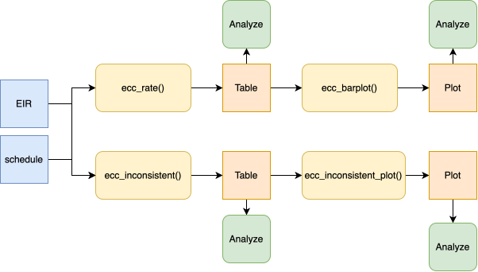

<a href="../es/eligibility_consistency_comparison_es.html" class="btn btn-outline-primary" role="button">🌐 Lea esto en español</a>

```{r setup, include = FALSE, message = FALSE, warning = FALSE}
library(pahoabc)
library(dplyr)
library(knitr)
```

# Rationale

National immunization schedules define, for each dose, a target age window during which a person is expected to be vaccinated (e.g., DTP1 should be administered between 54 and 90 days of age). A vaccination event that falls outside that window — administered too early or too late — indicates either a data quality issue or a programmatic gap in service delivery timeliness.

The eligibility consistency comparison module allows users to systematically identify, quantify, and visualize whether the age at vaccination (`date_vax - date_birth`) falls within the age window defined by the vaccination schedule (`age_schedule_low`, `age_schedule_high`).

> **Note**
>
> All functions used for eligibility consistency comparison analyses within PAHOabc begin with the `ecc_` prefix.

> **Warning**
>
> The `ecc_` functions calculate age at vaccination as `date_vax - date_birth`. If `data.EIR` contains records where `date_vax` occurs before `date_birth` (i.e., a negative age at vaccination), this points to a **date consistency** error rather than an eligibility one. When this happens, `ecc_` functions will emit a warning directing you to the [(D)ate (C)onsistency (C)omparison `dcc_` module](date_consistency_comparison_en.html) to identify and resolve those records first.

# Glossary

## Political Geographic Boundaries

Throughout this vignette, we will make reference to different levels of political geographic boundaries. These levels are defined by the country/territory and can have different names from country to country. PAHOabc is agnostic to these names and requires the user to recode their variable names to fit the PAHOabc structure.

Namely, PAHOabc can distinguish three administrative levels, which listed from top to bottom level are: ADM0, ADM1 and ADM2.

1. ADM0: The country. This is the top-most administrative level.
2. ADM1: The first geographic subdivision in the country. ADM0 contains several ADM1 subdivisions.
3. ADM2: The second geographic subdivision in the country. Each ADM1 contains several ADM2 subdivisions.

## Eligibility Categories

| Category | Meaning |
|---|---|
| `ELIGIBLE` | The age at vaccination falls within `[age_schedule_low, age_schedule_high]`. |
| `INELIGIBLE` | The age at vaccination falls outside `[age_schedule_low, age_schedule_high]` — vaccinated too early or too late. |
| `DATE_MISSING` | `date_vax` or `date_birth` is `NA`. |

# Usage

## Install Package

```{r install_package, eval=FALSE}
devtools::install_github("IM-Data-PAHO/pahoabc")
```

## Load Data

The functions in this module require your **EIR dataset** and a **vaccination schedule**, both in the standard PAHOabc format.

### EIR

The `pahoabc::pahoabc.EIR` data frame provides a simulated, nominal-level table representing individual vaccination events from an Electronic Immunization Registry (EIR). Each row corresponds to a single vaccination act for a person.

```{r pahoabc-EIR, message=FALSE}
pahoabc.EIR %>% head() %>% kable(caption = "Example Electronic Immunization Registry")
```

- `ID`: Unique person identification number.
- `date_birth`: Date of birth of person.
- `date_vax`: Date of vaccination event.
- `ADM1_residence` / `ADM2_residence`: First and second geographic administrative levels of residence.
- `dose`: Combined variable representing vaccine type and dose number (e.g., DTP1).

### Vaccination Schedule

The `pahoabc::pahoabc.schedule` dataset defines the national immunization schedule, listing each vaccine dose and the target age window for its administration, in days.

```{r pahoabc-schedule, message=FALSE}
pahoabc.schedule %>% kable(caption = "Example Immunization Schedule")
```

- `dose`: Combined variable representing vaccine type and dose number.
- `age_schedule`: The recommended age of administration of the corresponding `dose`, in days.
- `age_schedule_low`: The lower limit for the target age, in days.
- `age_schedule_high`: The upper limit for the target age, in days.

## Eligibility Consistency Comparison Analysis

### Expected Workflow

The `ecc_` suite contains four functions that work together:

1. `ecc_rate()` — computes eligibility rates, optionally disaggregated by dose and geographic level.
2. `ecc_barplot()` — visualizes the output of `ecc_rate()` as a stacked bar chart.
3. `ecc_inconsistent()` — lists individual ineligible and missing records with their day difference from the scheduled window.
4. `ecc_inconsistent_plot()` — visualizes the distribution of those day differences as a diverging lollipop plot.

The figure below shows the expected workflow.



<br>

### Step 1 — Compute eligibility rates with `ecc_rate()`

`ecc_rate()` compares the age at vaccination against the scheduled age window and returns the count and percentage of records that are `ELIGIBLE`, `INELIGIBLE`, or `DATE_MISSING`.

By default, `vaccines = NULL` pools all doses in `data.schedule` together. Here we compute pooled rates at the ADM1 level.

```{r ecc-rate, message=FALSE}
rate_df <- ecc_rate(
  data.EIR      = pahoabc.EIR,
  data.schedule = pahoabc.schedule,
  geo_level     = "ADM1"
)

rate_df %>% kable(digits = 2, caption = "Pooled eligibility rates by ADM1")
```

Specifying `vaccines` disaggregates the results by `dose`, one row set per vaccine:

```{r ecc-rate-by-dose, message=FALSE}
rate_by_dose_df <- ecc_rate(
  data.EIR      = pahoabc.EIR,
  data.schedule = pahoabc.schedule,
  geo_level     = "ADM1",
  vaccines      = c("DTP1", "DTP2", "DTP3")
)

rate_by_dose_df %>% head(10) %>% kable(digits = 2, caption = "Eligibility rates by dose and ADM1")
```

#### Parameters accepted

- `data.EIR`: EIR data frame in PAHOabc format.
- `data.schedule`: Vaccination schedule data frame in PAHOabc format.
- `geo_level`: `"ADM0"` (default), `"ADM1"`, or `"ADM2"`.
- `vaccines`: Character vector of doses to include, disaggregating by `dose`. Default `NULL` pools all doses in `data.schedule`.
- `birth_cohorts`: Numeric vector of birth cohort year(s) to filter to. Default `NULL` uses all available cohorts.

### Step 2 — Visualize rates with `ecc_barplot()`

The output of `ecc_rate()` can be passed directly to `ecc_barplot()` to produce a stacked bar chart. If `data` is disaggregated by `dose`, the plot is automatically faceted by dose.

```{r ecc-barplot, message=FALSE, fig.width=10, fig.height=5}
ecc_barplot(data = rate_df)
```

```{r ecc-barplot-facet, message=FALSE, fig.width=10, fig.height=6}
ecc_barplot(data = rate_by_dose_df)
```

#### Parameters accepted

- `data`: Output of `ecc_rate()`.
- `within_ADM1`: Character vector to filter to specific ADM1 units when `geo_level = "ADM2"`. Default: `NULL`.
- `plot_missing`: Boolean. If `TRUE` (default), `DATE_MISSING` records are shown as a separate bar segment so all bars sum to 100%.

#### Interpretation

Each bar represents a geographic unit and is divided into segments: `ELIGIBLE` (blue), `INELIGIBLE` (orange), and `DATE_MISSING` (grey). Bars that are predominantly orange indicate units where a large share of doses are administered outside the recommended age window — a signal worth investigating for service delivery timeliness issues.

### Step 3 — Inspect individual ineligible records with `ecc_inconsistent()`

`ecc_inconsistent()` returns a record-level table of all `INELIGIBLE` and `DATE_MISSING` entries, including the number of days outside the scheduled window.

```{r ecc-inconsistent, message=FALSE}
inconsistent_df <- ecc_inconsistent(
  data.EIR      = pahoabc.EIR,
  data.schedule = pahoabc.schedule,
  vaccines      = "DTP1"
)

inconsistent_df %>% head(10) %>% kable(caption = "Sample of ineligible and missing DTP1 records")
```

#### Parameters accepted

- `data.EIR`: EIR data frame in PAHOabc format.
- `data.schedule`: Vaccination schedule data frame in PAHOabc format.
- `vaccines`: Character vector of doses to include. Default `NULL` includes all doses in `data.schedule`.
- `birth_cohorts`: Numeric vector of birth cohort year(s) to filter to. Default `NULL` uses all available cohorts.

The `days_outside_range` column is negative when a person was vaccinated before `age_schedule_low`, and positive when vaccinated after `age_schedule_high` (`NA` when a date is missing). This table can be exported for record-level correction workflows.

### Step 4 — Visualize the distribution of day differences with `ecc_inconsistent_plot()`

`ecc_inconsistent_plot()` produces a diverging lollipop plot of ineligible records, binned by the **magnitude** of days outside the scheduled window. The same bins are shared by both directions: records vaccinated too early are plotted below zero, and records vaccinated too late are plotted above zero.

```{r ecc-inconsistent-plot, message=FALSE, fig.width=10, fig.height=5}
ecc_inconsistent_plot(
  data.EIR      = pahoabc.EIR,
  data.schedule = pahoabc.schedule,
  vaccines      = "DTP1"
)
```

When more than one vaccine is specified, the plot is automatically faceted by dose:

```{r ecc-inconsistent-plot-facet, message=FALSE, fig.width=12, fig.height=7}
ecc_inconsistent_plot(
  data.EIR      = pahoabc.EIR,
  data.schedule = pahoabc.schedule,
  vaccines      = c("DTP1", "DTP2", "DTP3")
)
```

#### Parameters accepted

- `data.EIR`: EIR data frame in PAHOabc format.
- `data.schedule`: Vaccination schedule data frame in PAHOabc format.
- `vaccines`: Character vector of doses to include, faceting the plot by `dose` when more than one is given. Default `NULL` pools all doses in `data.schedule` (no facet).
- `day_groups`: List of `c(lower, upper)` numeric pairs defining the magnitude bins shared by both directions. The last bin is always extended to `Inf` and labelled `"X+"`. Default: 10-day bins from 0 to 100.

To use custom bin widths — for example, finer resolution for small differences:

```{r ecc-inconsistent-plot-custom, message=FALSE, fig.width=10, fig.height=5}
ecc_inconsistent_plot(
  data.EIR      = pahoabc.EIR,
  data.schedule = pahoabc.schedule,
  vaccines      = "DTP1",
  day_groups    = list(c(0, 5), c(5, 15), c(15, 30), c(30, 60), c(60, 120))
)
```

#### Interpretation

The horizontal axis shows the magnitude of days outside the scheduled window, shared by both directions. Points below zero represent records vaccinated too early (before `age_schedule_low`); points above zero represent records vaccinated too late (after `age_schedule_high`). Bins with large "too late" counts often point to programmatic delays in service delivery, while "too early" counts can point to data entry errors or off-schedule vaccination campaigns.

# Summary

The `ecc_` module provides a complete pipeline for assessing eligibility consistency in EIR data. Starting from `ecc_rate()` for a geographic and dose-level overview, through `ecc_barplot()` for visualization, to `ecc_inconsistent()` for record-level inspection and `ecc_inconsistent_plot()` for characterizing the magnitude and direction of timing errors, the suite equips data managers and public health analysts with the tools needed to detect, quantify, and prioritize service delivery timeliness issues.
