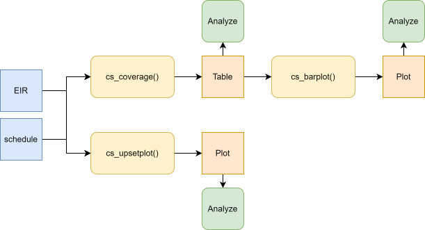

<a href="../en/complete_schedule_en.html" class="btn btn-outline-primary" role="button">🌐 Read this in English</a>

```{r setup, include = FALSE, message = FALSE, warning = FALSE}
library(pahoabc)
library(dplyr)
library(knitr)
```

# Fundamento

El propósito de este análisis es evaluar si la población objetivo recibió todas las vacunas que le corresponden según el esquema de vacunación definido por el país para una ubicación, cohorte y edad específicas.

Imagine la República de "ImmunoNation". En ese país, el esquema completo de vacunación para un niño podría incluir lo siguiente:

- *Al nacer*: 1 dosis de la vacuna BCG (que protege contra la tuberculosis).
- *Durante los primeros 11 meses*: 3 dosis de una vacuna que contiene DTP (esta vacuna combinada protege contra difteria, tétanos y tos ferina).
- *A los 12 meses*: 1 dosis de la vacuna SRP (que protege contra sarampión, rubéola y paperas).
- *En algún momento de la infancia*: 1 dosis de la vacuna contra la fiebre amarilla.

Este es solo un ejemplo de cómo podría ser un esquema completo de vacunación. Cada país define las vacunas y el número de dosis necesarias para proteger a su población frente a distintas enfermedades.

Para construir este indicador, se evalúa si cada persona recibió todas las dosis incluidas en el esquema.

> **Nota**
>
> Todas las funciones utilizadas para los análisis de cobertura de esquema completo dentro de PAHOabc comienzan con el prefijo `cs_`.

# Glosario

## Divisiones político-geográficas

A lo largo de esta viñeta se hace referencia a distintos niveles de división político-geográfica. Estos niveles son definidos por cada país o territorio y pueden recibir nombres diferentes. PAHOabc no depende de esos nombres locales; por eso, el usuario debe recodificar sus variables para ajustarlas a la estructura que utiliza el paquete.

En concreto, PAHOabc puede distinguir tres niveles administrativos que, listados del nivel superior al inferior, son: ADM0, ADM1 y ADM2.

1. ADM0: El país. Este es el nivel administrativo más alto.
2. ADM1: La primera subdivisión geográfica del país. ADM0 contiene varias subdivisiones ADM1.
3. ADM2: La segunda subdivisión geográfica del país. Cada ADM1 contiene varias subdivisiones ADM2.

## Nombres de vacunas

Los conjuntos de datos de ejemplo utilizan una convención específica para nombrar las dosis de vacunas. Es posible que esta convención no coincida con la que usa su país o institución, pero esto no afecta el uso del paquete si los nombres se aplican de manera consistente.

Por ejemplo, los nombres de las vacunas utilizados en el paquete PAHOabc son:

| Abreviatura  | Nombre completo                                                  |
|--------------|------------------------------------------------------------------|
| SRP1         | Vacuna contra sarampión, rubéola y paperas (1.ª dosis)           |
| DTP1         | Vacuna contra difteria, tétanos y tos ferina (1.ª dosis)         |
| DTP2         | Vacuna contra difteria, tétanos y tos ferina (2.ª dosis)         |
| DTP3         | Vacuna contra difteria, tétanos y tos ferina (3.ª dosis)         |
| BCG RN       | Vacuna Bacillus Calmette–Guérin (al nacer)                       |
| YFV1         | Vacuna contra la fiebre amarilla (1.ª dosis)                     |

# Uso

## Instalar el paquete

El primer paso para ejecutar los análisis de cobertura de esquema completo es instalar el paquete PAHOabc disponible en GitHub.

```{r, install_package, eval=FALSE}
devtools::install_github("IM-Data-PAHO/pahoabc")
```

## Cargar los datos

Las funciones de este módulo requieren tres conjuntos de datos en un formato específico.

1. Su RNVe.
2. El esquema de vacunación relacionado con este RNVe.
3. Una tabla con denominadores poblacionales según el nivel geográfico de su análisis.
    1. Esto es opcional para la función `cs_coverage()` (pero no se muestra en esta viñeta).

Para facilitar la prueba de PAHOabc y la comprensión de la estructura requerida, a continuación se presentan los conjuntos de datos de ejemplo que utiliza este módulo.

### RNVe

El conjunto de datos `pahoabc::pahoabc.EIR` proporciona un ejemplo de Registro Nominal de Vacunación electrónico (RNVe). Es una tabla nominal simulada con eventos individuales de vacunación. Cada fila corresponde a una vacunación e incluye información sobre la residencia de la persona, el lugar donde fue vacunada (ocurrencia), su fecha de nacimiento y la dosis recibida.

```{r pahoabc-EIR, message=FALSE}
pahoabc.EIR %>% head() %>% kable(caption = "Ejemplo de Registro Nominal de Vacunación electrónico")
```

- `ID`: Número único de identificación de la persona.
- Fecha de nacimiento (`date_birth`): Fecha de nacimiento de la persona.
- Fecha de vacunación (`date_vax`): Fecha del evento de vacunación.
- ADM1: Primer nivel administrativo geográfico del país.
- ADM2: Segundo nivel administrativo geográfico del país.
- Lugar de residencia (`Residence`): Lugar donde vive la persona.
- Lugar de vacunación (`Occurrence`): Lugar donde ocurrió la vacunación.
- Dosis (`dose`): Variable combinada que representa el tipo de vacuna y su número de dosis correspondiente. Por ejemplo, DTP1 se refiere a la primera dosis de una vacuna que contiene componentes de difteria, tétanos y tos ferina.

### Esquema de vacunación

El conjunto de datos `pahoabc::pahoabc.schedule` define el esquema nacional de vacunación, con cada dosis y su edad recomendada de administración (en días). Esta tabla permite determinar si una persona tiene las vacunas que le corresponden según el esquema.

```{r pahoabc-schedule, message=FALSE}
pahoabc.schedule %>% kable(caption = "Ejemplo de esquema de vacunación")
```

- Dosis (`dose`): Variable combinada que representa el tipo de vacuna y su número de dosis correspondiente. Por ejemplo, DTP1 se refiere a la primera dosis de una vacuna que contiene componentes de difteria, tétanos y tos ferina.
- Edad programada (`age_schedule`): Edad recomendada de administración de la dosis, en días.
- Límite inferior de edad (`age_schedule_low`): Límite inferior de la edad objetivo, en días.
- Límite superior de edad (`age_schedule_high`): Límite superior de la edad objetivo, en días.

> **Nota**
>
> Los nombres de las dosis en la columna `dose` deben coincidir exactamente con los del conjunto de datos `pahoabc.EIR`.

### Denominadores poblacionales

Este módulo requiere una tabla con denominadores poblacionales. El nivel geográfico de esta tabla debe coincidir con el nivel geográfico del análisis. Por ejemplo, para un análisis a nivel ADM1, la tabla de denominadores poblacionales debe tener la siguiente estructura.

```{r pahoabc-pop-ADM1, message=FALSE}
pahoabc.pop.ADM1 %>% head() %>% kable(caption = "Ejemplo de población a nivel ADM1")
```

Esta tabla está en formato largo y contiene la población (`population`) de niños de una edad (`age`) específica durante un año (`year`) determinado para un nivel `ADM1`.

## Análisis de cobertura de esquema completo

### Flujo de trabajo esperado

Las funciones `cs_coverage()`, `cs_barplot()` y `cs_upsetplot()` permiten analizar y visualizar la cobertura de esquema completo. Su relación se muestra en la Figura 1.



<br>

### Ejemplo

A continuación se presenta un ejemplo simplificado para calcular la cobertura de esquema completo en el primer nivel administrativo subnacional, usando la cohorte de nacimiento de 2022.

```{r cov-analysis-example, message=FALSE}

# calcular la cobertura
coverage_df <- cs_coverage(
  data.EIR = pahoabc.EIR,
  data.schedule = pahoabc.schedule,
  geo_level = "ADM1",
  birth_cohorts = 2022 # esto puede ser un vector de años
)

# mostrar los resultados en una tabla
coverage_df %>%
  kable(digits = 2, caption = "Cobertura de esquema completo a nivel ADM1")
```

### Gráfico de barras

Es posible mostrar los resultados obtenidos previamente en un gráfico de barras con `cs_barplot()`.

```{r cov-viz-example, message=FALSE, fig.width=12, fig.height=6}

# visualizar el resultado de cs_coverage()
coverage_plot <- cs_barplot(data = coverage_df)

# mostrar
coverage_plot
```

### Gráfico UpSet

La función `cs_upsetplot()` genera un gráfico UpSet para evaluar el porcentaje de personas incluidas en el RNVe que recibieron las distintas combinaciones posibles de vacunas. La barra naranja representa la proporción de personas que recibieron todas las vacunas evaluadas; por lo tanto, muestra la cobertura de esquema completo. Las barras horizontales muestran la proporción de personas que recibió cada vacuna específica, es decir, la cobertura de esa vacuna.

```{r cov-upset-example, message=FALSE, fig.width=12, fig.height=6}

# producir el gráfico UpSet
coverage_upset <- cs_upsetplot(
  data.EIR = pahoabc.EIR,
  data.schedule = pahoabc.schedule,
  birth_cohort = 2022
)

# mostrar
coverage_upset
```

En el ejemplo, la cobertura de esquema completo alcanzó el 13,7 % y está representada por la barra naranja.

También se observa que el 24,1 % de las personas en el RNVe recibió únicamente la vacuna BCG, y que la tercera combinación más frecuente (9,1 %) corresponde a personas que recibieron todas las demás vacunas excepto BCG. Esto podría indicar errores en el registro de la BCG al nacer, por ejemplo cuando se usan números de identificación temporales.
