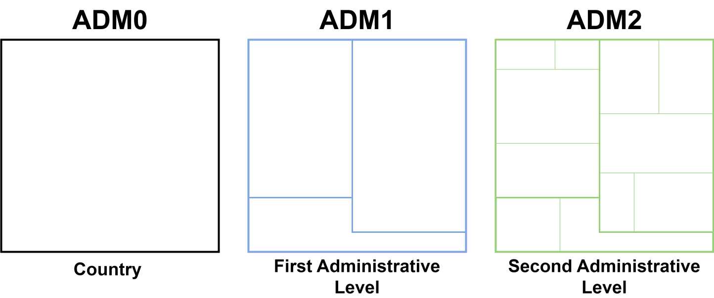

<a href="../en/example_datasets_en.html" class="btn btn-outline-primary" role="button">🌐 Read this in English</a>

```{r setup, include = FALSE, message = FALSE, warning = FALSE}
library(pahoabc)
library(dplyr)
library(knitr)
```

# Fundamento

El paquete PAHOabc incluye conjuntos de datos de ejemplo para ayudar a los usuarios a entender cómo funcionan sus herramientas. Estos datos simulan el sistema de información de inmunización de un país ficticio y están estructurados para funcionar con las funciones del paquete. Esta viñeta presenta cada conjunto de datos y explica cómo se usan en los distintos módulos.

# Glosario

## Divisiones político-geográficas

A lo largo de esta viñeta se hace referencia a distintos niveles de división político-geográfica. Estos niveles son definidos por cada país o territorio y pueden recibir nombres diferentes. PAHOabc no depende de esos nombres locales; por eso, el usuario debe recodificar sus variables para ajustarlas a la estructura que utiliza el paquete.

En concreto, PAHOabc puede distinguir tres niveles administrativos que, listados del nivel superior al inferior, son: ADM0, ADM1 y ADM2.

1. ADM0: El país. Este es el nivel administrativo más alto.
2. ADM1: La primera subdivisión geográfica del país. ADM0 contiene varias subdivisiones ADM1.
3. ADM2: La segunda subdivisión geográfica del país. Cada ADM1 contiene varias subdivisiones ADM2.



## Nombres de vacunas

Los conjuntos de datos de ejemplo utilizan una convención específica para nombrar las dosis de vacunas. Es posible que esta convención no coincida con la que usa su país o institución, pero esto no afecta el uso del paquete si los nombres se aplican de manera consistente.

Por ejemplo, los nombres de las vacunas utilizados en el paquete PAHOabc son:

| Abreviatura  | Nombre completo                                                  |
|--------------|------------------------------------------------------------------|
| SRP1         | Vacuna contra sarampión, rubéola y paperas (1.ª dosis)           |
| DTP1         | Vacuna contra difteria, tétanos y tos ferina (1.ª dosis)         |
| DTP2         | Vacuna contra difteria, tétanos y tos ferina (2.ª dosis)         |
| DTP3         | Vacuna contra difteria, tétanos y tos ferina (3.ª dosis)         |
| BCG RN       | Vacuna Bacillus Calmette–Guérin (al nacer)                       |
| YFV1         | Vacuna contra la fiebre amarilla (1.ª dosis)                     |

# Lista de conjuntos de datos de ejemplo

## pahoabc.EIR

El conjunto de datos `pahoabc::pahoabc.EIR` es el más importante del paquete. Proporciona un ejemplo de Registro Nominal de Vacunación electrónico (RNVe). Es una tabla nominal simulada con eventos individuales de vacunación. Cada fila corresponde a una vacunación e incluye información sobre la residencia de la persona, el lugar donde fue vacunada, su fecha de nacimiento y la dosis recibida.

```{r pahoabc-EIR, message=FALSE}
pahoabc.EIR %>% head() %>% kable(caption = "Ejemplo de Registro Nominal de Vacunación electrónico")
```

- `ID`: Número único de identificación de la persona.
- Fecha de nacimiento (`date_birth`): Fecha de nacimiento de la persona.
- Fecha de vacunación (`date_vax`): Fecha del evento de vacunación.
- ADM1: Primer nivel administrativo geográfico del país.
- ADM2: Segundo nivel administrativo geográfico del país.
- Lugar de residencia (`Residence`): Lugar donde vive la persona.
- Lugar de vacunación (`Occurrence`): Lugar donde ocurrió la vacunación.
- Dosis (`dose`): Variable combinada que representa el tipo de vacuna y su número de dosis correspondiente. Por ejemplo, DTP1 se refiere a la primera dosis de una vacuna que contiene componentes de difteria, tétanos y tos ferina.

## pahoabc.schedule

El conjunto de datos `pahoabc::pahoabc.schedule` define el esquema nacional de vacunación, con cada dosis y su edad recomendada de administración (en días). Esta tabla permite determinar si una persona tiene las vacunas que le corresponden según el esquema.

```{r pahoabc-schedule, message=FALSE}
pahoabc.schedule %>% kable(caption = "Ejemplo de esquema de vacunación")
```

- Dosis (`dose`): Variable combinada que representa el tipo de vacuna y su número de dosis correspondiente. Por ejemplo, DTP1 se refiere a la primera dosis de una vacuna que contiene componentes de difteria, tétanos y tos ferina.
- Edad programada (`age_schedule`): Edad recomendada de administración de la dosis, en días.
- Límite inferior de edad (`age_schedule_low`): Límite inferior de la edad objetivo, en días.
- Límite superior de edad (`age_schedule_high`): Límite superior de la edad objetivo, en días.

> **Nota**
>
> Los nombres de las dosis en la columna `dose` deben coincidir exactamente con los del conjunto de datos `pahoabc.EIR`.

## Conjuntos de datos de población

Los conjuntos de datos de población proporcionan estimaciones poblacionales en distintos niveles geográficos, para varios años y para niños de diferentes edades. Según el nivel geográfico del análisis, PAHOabc puede requerir la población correspondiente para usarla como denominador, principalmente en los análisis de cobertura.

### pahoabc.pop.ADM0

El conjunto de datos `pahoabc::pahoabc.pop.ADM0` proporciona estimaciones poblacionales agregadas a nivel nacional (ADM0).

```{r pahoabc-pop-ADM0, message=FALSE}
pahoabc.pop.ADM0 %>% kable(caption = "Ejemplo de población a nivel ADM0")
```

Esta tabla está en formato largo y contiene la población (`population`) de niños de una edad (`age`) específica durante un año (`year`) determinado.

### pahoabc.pop.ADM1

El conjunto de datos `pahoabc::pahoabc.pop.ADM1` proporciona datos poblacionales agregados al primer nivel administrativo subnacional (ADM1), que suele corresponder a regiones, provincias o estados.

```{r pahoabc-pop-ADM1, message=FALSE}
pahoabc.pop.ADM1 %>% head() %>% kable(caption = "Ejemplo de población a nivel ADM1")
```

Esta tabla está en formato largo y contiene la población (`population`) de niños de una edad (`age`) específica durante un año (`year`) determinado a nivel `ADM1`.

### pahoabc.pop.ADM2

El conjunto de datos `pahoabc::pahoabc.pop.ADM2` proporciona datos poblacionales más detallados por niveles ADM1 y ADM2, lo que permite análisis con mayor desagregación geográfica.

```{r pahoabc-pop-ADM2, message=FALSE}
pahoabc.pop.ADM2 %>% head() %>% kable(caption = "Ejemplo de población a nivel ADM2")
```

Esta tabla está en formato largo y contiene la población (`population`) de niños de una edad (`age`) específica durante un año (`year`) determinado a nivel `ADM2`.

# Resumen

Todos los conjuntos de datos de ejemplo se cargan automáticamente con el paquete. Puede explorar su estructura con `glimpse()` o `View()`. Están diseñados para funcionar con los argumentos predeterminados de las funciones, lo que permite probar y comprender cada módulo con una configuración mínima.

A continuación se presenta un resumen de los conjuntos de datos disponibles para su referencia.

| Conjunto de datos   | Descripción                                                   |
|---------------------|---------------------------------------------------------------|
| `pahoabc.EIR`       | Registro Nominal de Vacunación electrónico (RNVe)             |
| `pahoabc.schedule`  | Esquema de vacunación con nombres de dosis y edades           |
| `pahoabc.pop.ADM0`  | Estimaciones poblacionales agregadas a nivel nacional         |
| `pahoabc.pop.ADM1`  | Estimaciones poblacionales a nivel ADM1                       |
| `pahoabc.pop.ADM2`  | Estimaciones poblacionales a nivel ADM2                       |
