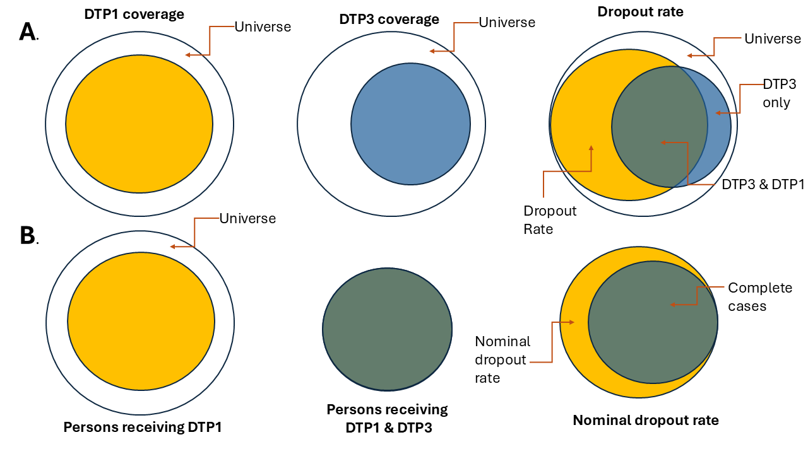
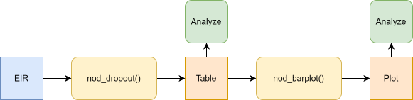

<a href="../en/nominal_dropout_en.html" class="btn btn-outline-primary" role="button">🌐 Read this in English</a>

```{r setup, include=FALSE}
knitr::opts_chunk$set(echo = TRUE)
library(pahoabc)
library(dplyr)
library(ggplot2)
library(knitr)
```

# Fundamento

La tasa de deserción es un indicador utilizado para evaluar la pérdida del seguimiento en los esquemas de vacunación. Refleja el porcentaje de personas que no recibieron una dosis final (p. ej., DTP3) entre quienes recibieron una dosis inicial (p. ej., DTP1). En los sistemas agregados, se estima mediante la siguiente fórmula:

$$
\text{Tasa de deserción (\%)} =
\frac{\text{dosis de DTP1 administradas} - \text{dosis de DTP3 administradas}}{\text{dosis de DTP1 administradas}} \times 100
$$

Realizar el análisis con datos agregados no garantiza que las personas que recibieron ambas dosis sean las mismas, como se muestra en la Figura 1A. Los registros nominales electrónicos de vacunación permiten un análisis persona a persona, asegurando que quienes recibieron ambas dosis sean efectivamente las mismas, como se ilustra en la Figura 1B.



<br>

> **Nota**
>
> Todas las funciones utilizadas para los análisis de deserción nominal dentro de PAHOabc comienzan con el prefijo `nod_`.

# Glosario

## Límites político-geográficos

A lo largo de esta viñeta haremos referencia a distintos niveles de límites político-geográficos. Estos niveles están definidos por el país/territorio y pueden tener distintos nombres de un país a otro. PAHOabc es agnóstico respecto a estos nombres y requiere que el usuario recodifique los nombres de sus variables para ajustarse a la estructura de PAHOabc.

En concreto, PAHOabc puede distinguir tres niveles administrativos que, listados del nivel superior al inferior, son: ADM0, ADM1 y ADM2.

1. ADM0: El país. Este es el nivel administrativo más alto.
2. ADM1: La primera subdivisión geográfica del país. ADM0 contiene varias subdivisiones ADM1.
3. ADM2: La segunda subdivisión geográfica del país. Cada ADM1 contiene varias subdivisiones ADM2.

## Nombres de las vacunas

Nuestros conjuntos de datos de ejemplo utilizan una convención de nombres específica para las dosis de vacunas. Es posible que esto no coincida con sus propios esquemas de nombres, pero no afectará el uso del paquete siempre que se asegure de ser consistente al nombrar las dosis de vacunas.

Por ejemplo, los nombres de las vacunas utilizados en el paquete PAHOabc son:

| Abreviatura  | Nombre completo                                                  |
|--------------|------------------------------------------------------------------|
| SRP1         | Vacuna contra sarampión, rubéola y parotiditis (1.ª dosis)       |
| DTP1         | Vacuna contra difteria, tétanos y tos ferina (1.ª dosis)         |
| DTP2         | Vacuna contra difteria, tétanos y tos ferina (2.ª dosis)         |
| DTP3         | Vacuna contra difteria, tétanos y tos ferina (3.ª dosis)         |
| BCG RN       | Vacuna Bacillus Calmette–Guérin (al nacer)                       |
| YFV1         | Vacuna contra la fiebre amarilla (1.ª dosis)                     |

# Uso

## Instalar el paquete

El primer paso para ejecutar el análisis de tasa de deserción nominal es instalar el paquete PAHOabc disponible en GitHub.

```{r, install_package, eval=FALSE}
devtools::install_github("IM-Data-PAHO/pahoabc")
```

## Cargar los datos

Las funciones de este módulo requieren que usted proporcione su **conjunto de datos EIR** en un formato específico.

Para facilitarle la prueba de la funcionalidad de PAHOabc y la comprensión de la estructura que requerimos para sus conjuntos de datos, exploraremos ahora el conjunto de datos de ejemplo proporcionado por PAHOabc que requiere este módulo.

### EIR

El data frame `pahoabc::pahoabc.EIR` proporciona una tabla simulada de nivel nominal que representa eventos de vacunación individuales de un Registro Electrónico de Inmunización (EIR). Cada fila corresponde a un único acto de vacunación de una persona, incluyendo información sobre su residencia, dónde fue vacunada (ocurrencia), su fecha de nacimiento y la dosis de vacuna recibida.

```{r pahoabc-EIR, message=FALSE}
pahoabc.EIR %>% head() %>% kable(caption = "Ejemplo de Registro Electrónico de Inmunización")
```

- `ID`: Número único de identificación de la persona.
- `date_birth`: Fecha de nacimiento de la persona.
- `date_vax`: Fecha del evento de vacunación.
- ADM1: Hace referencia al primer nivel administrativo geográfico del país.
- ADM2: Hace referencia al segundo nivel administrativo geográfico del país.
- Residence: Hace referencia al lugar donde vive la persona.
- Occurrence: Hace referencia al lugar donde ocurrió el evento de vacunación.
- `dose`: Variable combinada que representa el tipo de vacuna y su número de dosis correspondiente. Por ejemplo, DTP1 se refiere a la primera dosis de una vacuna que contiene componentes de difteria, tétanos y tos ferina.

## Análisis de deserción nominal

PAHOabc incluye la funcionalidad para estimar la tasa de deserción nominal, persona por persona. Esto permite el análisis de cualquier par de dosis especificando una dosis inicial y una dosis final. Para una interpretación correcta, la dosis inicial debe preceder a la dosis final en el esquema de vacunación, por ejemplo: DTP1 – DTP3 o DTP1 – MCV1. Además, permite a los usuarios seleccionar el nivel de agregación de los resultados, que puede ser a nivel nacional o a niveles subnacionales (ADM1 o ADM2).

### Flujo de trabajo esperado

Las funciones `nod_dropout()` y `nod_barplot()` trabajan en conjunto para realizar el análisis y la visualización de la deserción nominal. La función `nod_dropout()` calcula la deserción nominal y los casos completos por residencia a través de los niveles administrativos, cohortes de nacimiento y vacunas seleccionados. Su salida (una tabla de datos) está estructurada para ser directamente compatible con `nod_barplot()`, que genera una visualización de los datos calculados.



<br>

### Ejemplo

A continuación, un caso de uso sencillo de la función `nod_dropout()`, donde calculamos la deserción nominal para el nivel ADM1 entre DTP1 y DTP3 en nuestro conjunto de datos de ejemplo.

```{r, nom-dropout-analysis, warning=FALSE, message=FALSE}
#Ejecuta la función de deserción nominal
example_dropout <- nod_dropout(data.EIR = pahoabc.EIR,
                               vaccine_init = "DTP1", #Vacuna inicial según su conjunto de datos
                               vaccine_end= "DTP3", #Vacuna final según su conjunto de datos
                               geo_level = "ADM1", #Puede ser ADM0, ADM1 o ADM2
                               birth_cohorts = NULL #Puede ser un vector de años o un año
                               )

# mostrar los resultados en una tabla
example_dropout %>%
  kable(digits = 3, caption = "Tasa de deserción nominal entre DTP1 y DTP3 a nivel ADM1")
```

#### Parámetros aceptados

-   `data.EIR`: Data frame de R estructurado con las variables listadas anteriormente.\
-   `vaccine_init`: El nombre (cadena de texto) de la vacuna que se usará como punto de inicio del análisis, tal como está almacenada en la columna **dose** del data frame.\
-   `vaccine_end`: El nombre (cadena de texto) de la vacuna que se usará como punto final del análisis, tal como está almacenada en la columna **dose** del data frame.\
-   `geo_level`: Nivel administrativo a utilizar; este es un parámetro opcional. Puede ser "ADM0", "ADM1" o "ADM2" como cadenas de texto. Si se omite, su valor predeterminado es "ADM0".
-   `birth_cohorts` (años): Parámetro para segmentar el análisis según el año de nacimiento de las personas en el data frame. Esta función utiliza la columna `date_birth` del data frame y puede ser un único año o un vector de años.

Los parámetros `data.EIR`, `vaccine_init` y `vaccine_end` son obligatorios. `geo_level` y `birth_cohorts` son opcionales y ayudan a segmentar los datos para análisis más precisos.

Consulte la documentación de la función usando `?nod_dropout()` en R para información adicional.

Esta salida puede pasarse directamente a la función `nod_barplot()` como se muestra a continuación.

```{r, nominal_dropout_plot, message=FALSE}
# Ejecuta la función nod_barplot
example_dropout_plot <- nod_barplot(data=example_dropout, order="alpha")

#mostrar el gráfico
example_dropout_plot

```

#### Parámetros aceptados

La función `nod_barplot()` acepta los siguientes parámetros:

-   `data`: Data frame formateado a partir del resultado de la función `nod_dropout()`.
-   `order`: Organiza las barras según tres opciones: "alpha", "desc" o "asc"; el valor predeterminado es "alpha".
-   `within_ADM1`: Permite filtrar dentro de un ADM1 y mostrar únicamente los datos ADM2 correspondientes al ADM1 especificado.

#### Interpretación

Este gráfico muestra la deserción nominal por nivel administrativo 1, así como una línea de 5 % que indica un umbral de deserción nominal. Tener una tasa de deserción alta significa que un gran porcentaje de las personas analizadas no se está registrando para las dosis de seguimiento de su esquema. Idealmente, toda persona que ha recibido una dosis de un esquema de múltiples dosis debería regresar para recibir la dosis de seguimiento. En este caso, el nivel administrativo **ADM1_1** es el que peor se desempeña, mientras que **ADM1_4** es el que mejor lo hace.

Todas las unidades administrativas tienen una tasa de deserción nominal por encima del **25 %**, lo que significa que al menos el 25 % de las personas de ese grupo objetivo **no regresó para su dosis de seguimiento**.

# Resumen

Monitorear con precisión la continuidad en los esquemas de vacunación de múltiples dosis es vital para los programas de inmunización. La *tasa de deserción nominal* —la proporción de personas que inician una serie (p. ej., DTP1) pero no reciben su dosis final (p. ej., DTP3)— ofrece una visión a nivel de persona del desempeño del programa que los conteos agregados no pueden brindar. Esta viñeta presenta PAHOabc, un paquete de R que agiliza el análisis de deserción nominal aprovechando los datos del registro electrónico de inmunización (EIR).

Tras definir conceptos clave —unidades administrativas (ADM0–2) y códigos estandarizados de vacuna-dosis— el documento guía al lector a través de un flujo de trabajo reproducible: instalar el paquete, explorar el EIR de ejemplo incluido, calcular la deserción con `nod_dropout()` y visualizar los resultados con `nod_barplot()`. Un ejemplo trabajado estima la deserción de DTP1→DTP3 a nivel ADM1, revelando que cada subdivisión supera el umbral de deserción del 25 %; ADM1_1 es la de peor desempeño, mientras que ADM1_4 es la de mejor desempeño en relación con una línea objetivo del 5 %.

Al combinar datos granulares del EIR con un flujo analítico transparente, PAHOabc permite obtener conocimientos precisos y geográficamente desagregados sobre las pérdidas de seguimiento, dotando a las autoridades de salud de la capacidad de dirigir las intervenciones donde más se necesitan.
