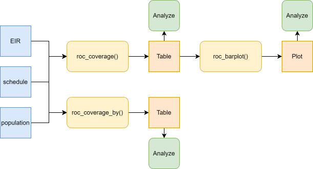
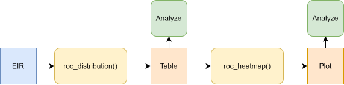

<a href="../en/residence_occurrence_en.html" class="btn btn-outline-primary" role="button">🌐 Read this in English</a>

```{r setup, include = FALSE, message = FALSE, warning = FALSE}
library(pahoabc)
library(dplyr)
library(ggplot2)
library(knitr)
```

# Fundamento

Es común que los Registros Electrónicos de Inmunización (EIR) capturen tanto el lugar de residencia como el lugar de ocurrencia del evento de vacunación. La cobertura de vacunación puede estimarse agrupando los eventos según cualquiera de las dos ubicaciones. Sin embargo, los denominadores se estiman típicamente con base en el lugar de residencia.

Usar la residencia o la ocurrencia como numerador puede llevar a una subestimación o sobreestimación de la cobertura y, en ocasiones, dar como resultado valores superiores al 100 %, especialmente en áreas donde los servicios de vacunación están más disponibles.

El módulo de residencia vs. ocurrencia del paquete PAHOabc proporciona un conjunto de funciones para explorar y analizar este fenómeno.

> **Nota**
>
> Todas las funciones utilizadas para los análisis de residencia y ocurrencia dentro de PAHOabc comienzan con el prefijo `roc_`.

# Glosario

## Límites político-geográficos

A lo largo de esta viñeta haremos referencia a distintos niveles de límites político-geográficos. Estos niveles están definidos por el país/territorio y pueden tener distintos nombres de un país a otro. PAHOabc es agnóstico respecto a estos nombres y requiere que el usuario recodifique los nombres de sus variables para ajustarse a la estructura de PAHOabc.

En concreto, PAHOabc puede distinguir tres niveles administrativos que, listados del nivel superior al inferior, son: ADM0, ADM1 y ADM2.

1. ADM0: El país. Este es el nivel administrativo más alto.
2. ADM1: La primera subdivisión geográfica del país. ADM0 contiene varias subdivisiones ADM1.
3. ADM2: La segunda subdivisión geográfica del país. Cada ADM1 contiene varias subdivisiones ADM2.

## Nombres de las vacunas

Nuestros conjuntos de datos de ejemplo utilizan una convención de nombres específica para las dosis de vacunas. Es posible que esto no coincida con sus propios esquemas de nombres, pero no afectará el uso del paquete siempre que se asegure de ser consistente al nombrar las dosis de vacunas.

Por ejemplo, los nombres de las vacunas utilizados en el paquete PAHOabc son:

| Abreviatura  | Nombre completo                                                  |
|--------------|------------------------------------------------------------------|
| SRP1         | Vacuna contra sarampión, rubéola y parotiditis (1.ª dosis)       |
| DTP1         | Vacuna contra difteria, tétanos y tos ferina (1.ª dosis)         |
| DTP2         | Vacuna contra difteria, tétanos y tos ferina (2.ª dosis)         |
| DTP3         | Vacuna contra difteria, tétanos y tos ferina (3.ª dosis)         |
| BCG RN       | Vacuna Bacillus Calmette–Guérin (al nacer)                       |
| YFV1         | Vacuna contra la fiebre amarilla (1.ª dosis)                     |

# Uso

## Instalar el paquete

El primer paso para ejecutar los análisis de residencia y ocurrencia es instalar el paquete PAHOabc disponible en GitHub.

```{r, install_package, eval=FALSE}
devtools::install_github("IM-Data-PAHO/pahoabc")
```

## Cargar los datos

Las funciones de este módulo requieren que usted proporcione tres conjuntos de datos en un formato específico.

1. Su EIR.
2. El esquema de vacunación relacionado con este EIR.
3. Una tabla con denominadores poblacionales según el nivel geográfico de su análisis.

Para facilitarle la prueba de la funcionalidad de PAHOabc y la comprensión de la estructura que requerimos para sus conjuntos de datos, exploraremos ahora los conjuntos de datos de ejemplo proporcionados por PAHOabc que requiere este módulo.

### EIR

El data frame `pahoabc::pahoabc.EIR` proporciona una tabla simulada de nivel nominal que representa eventos de vacunación individuales de un Registro Electrónico de Inmunización (EIR). Cada fila corresponde a un único acto de vacunación de una persona, incluyendo información sobre su residencia, dónde fue vacunada (ocurrencia), su fecha de nacimiento y la dosis de vacuna recibida.

```{r pahoabc-EIR, message=FALSE}
pahoabc.EIR %>% head() %>% kable(caption = "Ejemplo de Registro Electrónico de Inmunización")
```

- `ID`: Número único de identificación de la persona.
- `date_birth`: Fecha de nacimiento de la persona.
- `date_vax`: Fecha del evento de vacunación.
- ADM1: Hace referencia al primer nivel administrativo geográfico del país.
- ADM2: Hace referencia al segundo nivel administrativo geográfico del país.
- Residence: Hace referencia al lugar donde vive la persona.
- Occurrence: Hace referencia al lugar donde ocurrió el evento de vacunación.
- `dose`: Variable combinada que representa el tipo de vacuna y su número de dosis correspondiente. Por ejemplo, DTP1 se refiere a la primera dosis de una vacuna que contiene componentes de difteria, tétanos y tos ferina.

### Esquema de vacunación

El conjunto de datos `pahoabc::pahoabc.schedule` define el esquema nacional de vacunación, listando cada dosis de vacuna y su edad recomendada de administración (en días). Ayuda al paquete a determinar si una persona está al día con sus vacunas.

```{r pahoabc-schedule, message=FALSE}
pahoabc.schedule %>% kable(caption = "Ejemplo de esquema de vacunación")
```

- `dose`: Variable combinada que representa el tipo de vacuna y su número de dosis correspondiente. Por ejemplo, DTP1 se refiere a la primera dosis de una vacuna que contiene componentes de difteria, tétanos y tos ferina.
- `age_schedule`: La edad recomendada de administración de la `dose` correspondiente, en días.
- `age_schedule_low`: El límite inferior de la edad objetivo en días.
- `age_schedule_high`: El límite superior de la edad objetivo en días.

> **Nota**
>
> Los nombres en `dose` deben coincidir exactamente con los de la columna `dose` del conjunto de datos `pahoabc.EIR`.

### Denominadores poblacionales

Este módulo requerirá que usted proporcione una tabla con denominadores poblacionales. El nivel geográfico de esta tabla dependerá directamente del nivel geográfico de su análisis. Por ejemplo, si fuera a realizar un análisis a nivel ADM1, la tabla de denominadores poblacionales requerida debe contener lo siguiente.

```{r pahoabc-pop-ADM1, message=FALSE}
pahoabc.pop.ADM1 %>% head() %>% kable(caption = "Ejemplo de población a nivel ADM1")
```

Tenga en cuenta que esta tabla está en formato largo y contiene la `population` correspondiente de niños de una `age` específica durante un `year` determinado para un cierto nivel `ADM1`.

> **Nota**
>
> Si su análisis es a un nivel político-geográfico diferente, consulte `pahoabc::pahoabc.pop.ADM0` y `pahoabc::pahoabc.pop.ADM2` para conocer el formato y las columnas requeridas.

## Análisis de cobertura

La primera subsección de este módulo proporciona una forma de analizar las tasas de cobertura tanto por lugar de residencia como por lugar de vacunación (ocurrencia).

### Flujo de trabajo esperado

Las funciones `roc_coverage()` y `roc_barplot()` trabajan en conjunto para realizar el análisis y la visualización de la cobertura. La función `roc_coverage()` calcula la cobertura de vacunación tanto por residencia como por ocurrencia a través de los niveles administrativos, años y vacunas seleccionados. Su salida (una tabla de datos) está estructurada para ser directamente compatible con `roc_barplot()`, que genera una visualización para un año y una vacuna específicos.

Alternativamente, la función `roc_coverage_by()` está disponible cuando se desea calcular la cobertura por residencia o por ocurrencia (pero no por ambas). Si bien produce una tabla similar, su salida no es compatible con `roc_barplot()`.



<br>

### Ejemplo

A continuación, un caso de uso sencillo de la función `roc_coverage()`, donde calculamos la cobertura por ambas métricas para la vacuna DTP1 en 2023 para nuestros conjuntos de datos de ejemplo.

```{r cov-analysis-example, message=FALSE}

# calcular la cobertura
coverage_df <- roc_coverage(
  data.EIR = pahoabc.EIR,
  data.schedule = pahoabc.schedule,
  data.pop = pahoabc.pop.ADM1,
  geo_level = "ADM1",
  years = 2023, # esto puede ser un vector de años
  vaccines = "DTP1" # esto puede ser un vector de vacunas
)

# mostrar los resultados en una tabla
coverage_df %>%
  kable(digits = 3, caption = "Cobertura de vacunación a nivel ADM1")
```

Esta salida puede pasarse directamente a la función `roc_barplot()` como se muestra a continuación.

```{r cov-viz-example, message=FALSE, fig.width=12, fig.height=6}

# visualizar la salida de roc_coverage()
coverage_plot <- roc_barplot(
  data = coverage_df,
  year = 2023,
  vaccine = "DTP1"
)

# mostrar
coverage_plot
```

Este gráfico muestra la cobertura de vacunación alcanzada por cada nivel administrativo subnacional, considerando tanto el lugar de ocurrencia como el lugar de residencia. Las barras amarillas representan la cobertura por lugar de ocurrencia, es decir, que el numerador incluye todas las dosis administradas en esa ubicación. Los diamantes naranjas representan la cobertura por lugar de residencia, es decir, que el numerador incluye a las personas que residen en esa ubicación, independientemente de dónde recibieron la vacuna.

Podemos observar que la cobertura por **residencia y ocurrencia** en ADM1_1, ADM1_4 y ADM1_5 es similar. Sin embargo, en ADM1_2 y ADM1_3 hay diferencias entre los dos tipos de cobertura.

En ADM1_2, la cobertura por ocurrencia alcanza el 141 %, mientras que la cobertura por residencia es del 95 %, resultando en una diferencia de 46 puntos porcentuales. En ADM1_3, la cobertura por ocurrencia es del 80 %, mientras que la cobertura por residencia es del 90 %, con una diferencia de 10 puntos porcentuales a favor de la cobertura por residencia.

Estos patrones sugieren un flujo poblacional significativo entre áreas administrativas. Específicamente, en ADM1_2, la alta cobertura por ocurrencia junto con una menor cobertura por residencia indica que muchas personas vacunadas en esta área en realidad residen en otro lugar. Por el contrario, ADM1_3 muestra una mayor cobertura por residencia que por ocurrencia, lo que sugiere que un número significativo de sus residentes se desplaza a otras áreas para recibir sus vacunas.

## Análisis de distribución de dosis

Las funciones de análisis de distribución de este paquete ayudan a analizar dónde se vacunan las personas según su lugar de residencia.

### Flujo de trabajo esperado

Las funciones `roc_distribution()` y `roc_heatmap()` proporcionan una forma de analizar el flujo poblacional entre áreas administrativas. Por ejemplo, uno podría interesarse en observar dónde se vacunan las personas que residen en una sola región (p. ej., ¿se vacunan todas dentro de su propia región o se desplazan a otras regiones?).

La figura a continuación muestra el flujo de trabajo esperado para estas funciones.



<br>

### Ejemplo a nivel del primer nivel administrativo

Este análisis solo requiere que usted proporcione su EIR junto con otros parámetros sencillos. Por ejemplo, calculemos cómo se distribuye la vacunación en el primer nivel administrativo para la vacuna DTP1 en 2023.

```{r dist-analysis-example, message=FALSE}

# calcular la distribución de dosis para cada lugar de residencia
distribution_df <- roc_distribution(
  data.EIR = pahoabc.EIR,
  vaccine = "DTP1",
  geo_level = "ADM1",
  birth_cohort = 2023,
  include_self_matches = TRUE
)

# mostrar los resultados en una tabla (ver solo un par de regiones por simplicidad)
distribution_df %>%
  filter(ADM1_residence %in% c("ADM1_1", "ADM1_3")) %>%
  kable(digits = 3, caption = "Distribución de vacunación para cada lugar de residencia por lugar de ocurrencia")
```

Por ejemplo, el 87 % de las personas que residen en ADM1_3 se vacunaron también allí contra DTP1. Pero un 13 % adicional recibió su vacuna de DTP1 en otro lugar (en concreto, en ADM1_2). Si desea profundizar en las personas que se vacunaron en un lugar diferente a su lugar de residencia, puede establecer el parámetro `include_self_matches` en `FALSE`.

```{r dist-analysis-example-2, message=FALSE}

# calcular la distribución de dosis para cada lugar de residencia
distribution_df2 <- roc_distribution(
  data.EIR = pahoabc.EIR,
  vaccine = "DTP1",
  geo_level = "ADM1",
  birth_cohort = 2023,
  # establecer esto en FALSE para excluir los casos en que las personas se vacunan en su lugar de residencia
  include_self_matches = FALSE
)

# mostrar los resultados en una tabla (centrarse solo en ADM1_3 para este ejemplo)
distribution_df2 %>%
  filter(ADM1_residence == "ADM1_3") %>%
  kable(digits = 3, caption = "¿Dónde se vacunan los residentes de ADM1_3?")
```

Esto muestra que el 96 % de las personas de ADM1_3 **que no se vacunan en su lugar de residencia** se vacunan en ADM1_2.

La función `roc_heatmap()` puede ofrecer una imagen más clara de esto.

```{r dist-viz-example, message=FALSE, fig.width=12, fig.height=6}
library(patchwork) # para mostrarlos lado a lado

# generar los gráficos
distribution_plot <- roc_heatmap(distribution_df) # con coincidencias propias
distribution_plot2 <- roc_heatmap(distribution_df2) # sin coincidencias propias

# agregar subtítulo
distribution_plot <- distribution_plot + labs(subtitle = "Con coincidencias propias")
distribution_plot2 <- distribution_plot2 + labs(subtitle = "Sin coincidencias propias")

# mostrarlos lado a lado
distribution_plot + distribution_plot2
```

> **Nota**
>
> El gráfico de la derecha muestra la proporción de dosis administradas en un lugar **diferente a su lugar de residencia**. Por eso la diagonal está vacía.

Estos gráficos pueden leerse de forma vertical u horizontal. Al leer el gráfico verticalmente, las columnas sumarán 100 % (salvo un error de redondeo). Es decir, cada columna representa la población de, por ejemplo, ADM1_1 y dónde se vacunan. Por ejemplo, si nos concentramos en el gráfico de la derecha y lo leemos verticalmente, podemos decir que, del total de personas que residen en ADM1_1 y se vacunan en un lugar diferente a su lugar de residencia, el 54 % lo hace en ADM1_3, el 31 % en ADM1_2 y un 16 % restante en ADM1_4 y ADM1_5.

Al leer horizontalmente, las filas **no** sumarán 100 %, pero siguen siendo indicativas de las residencias de las personas que se vacunan en una determinada región. Por ejemplo, leyendo el gráfico de la izquierda de forma horizontal podemos notar que el 92 % de los residentes de ADM1_2 se vacunan también allí, pero esta región también vacuna a una proporción significativa de residentes de ADM1_3 (13 %).

### Ejemplo a nivel del segundo nivel administrativo

Un análisis a un nivel más granular es beneficioso en este caso. Repitamos el proceso anterior, pero al segundo nivel administrativo (p. ej., distritos dentro de una determinada región).

```{r dist-analysis-example-3, message=FALSE, fig.width=12, fig.height=6}

# calcular la distribución de dosis para cada lugar de residencia al segundo
# nivel administrativo (centrarse solo en ADM1_3 para este ejemplo)
distribution_df3 <- roc_distribution(
  data.EIR = pahoabc.EIR,
  vaccine = "DTP1",
  geo_level = "ADM2",
  birth_cohort = 2023,
  include_self_matches = FALSE,
  within_ADM1 = "ADM1_3" # establecer la región en la que profundizar
)

# mostrar los resultados en un gráfico
distribution_plot3 <- roc_heatmap(
  distribution_df3
)

# mostrar
distribution_plot3
```

En este mapa de calor observamos la proporción de eventos de vacunación que ocurren en una ubicación diferente al lugar de residencia, desglosada por el segundo nivel administrativo.

Como ejemplo, es notable que, entre todas las personas que residen en ADM2_3_10 y se vacunan fuera de su área de residencia, el 72 % recibe su vacuna en ADM2_3_11. De manera similar, el 23 % de las personas de ADM2_3_23 que se vacunan en otro lugar lo hacen en ADM2_3_11.

Mirando el mapa de calor horizontalmente, podemos ver que ADM2_3_20 provee vacunación a un gran número de personas provenientes de otras áreas: el 35 % de las de ADM2_3_7, el 18 % de ADM2_3_15, el 17 % de ADM2_3_12, el 14 % de ADM2_3_17, etc.

La fila superior también es interesante, ya que indica a las personas que se vacunan completamente fuera de ADM1_3. Por ejemplo, en la columna 4, el 85 % de los residentes de ADM2_3_13 se vacunan fuera de ADM1_3, lo que sugiere un fuerte flujo poblacional.

# Resumen

Esta viñeta mostró cómo puede usar el paquete PAHOabc para comparar la cobertura de vacunación por lugar de residencia y por lugar de ocurrencia, y para explorar cómo se desplazan las personas entre áreas para vacunarse.

Vimos que la cobertura puede variar mucho dependiendo de qué ubicación se utilice y, en algunos casos, la cobertura por ocurrencia puede superar el 100 % —una señal de que personas de otros lugares vienen a vacunarse—. Las funciones de distribución y mapa de calor ayudan a visualizar estos patrones y pueden revelar qué áreas actúan como centros de servicio o hacia dónde se dirigen las personas para vacunarse.

En general, este tipo de análisis ayuda a comprender los flujos poblacionales y apoya una mejor planificación de los programas de inmunización.
