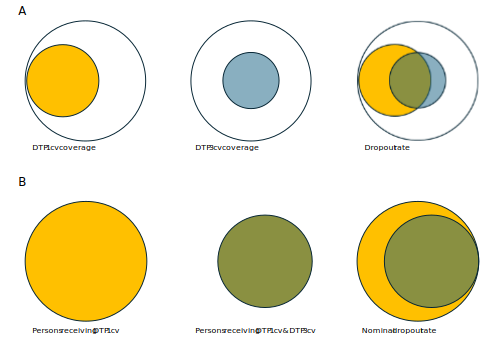

```{r setup, include=FALSE}
knitr::opts_chunk$set(echo = TRUE)
```

## Rationale

The dropout rate is an indicator used to evaluate the loss of follow-up in vaccination schedules. It reflects the percentage of individuals who did not receive a final dose (DTP3cv) among those who received an initial dose (DTP1cv). In aggregated systems, it is estimated using the following formula:

Performing the analysis with aggregated data does not guarantee that the individuals who received both doses are the same, as shown in Figure 1a. Electronic nominal vaccination records enable a person-to-person analysis, ensuring that the individuals who received both doses are indeed the same, as illustrated in Figure 1b.



## Function description

PAHOabc includes the functionality to estimate the dropout rate nominally, referred to as the nominal dropout rate. This allows for the analysis of any pair of doses by specifying an initial dose and a final dose. For correct interpretation, the initial dose must precede the final dose in the vaccination schedule, for example: DTP1cv – DTP3cv or DTP1cv – MCV. Additionally, it allows users to select the level of aggregation for the results, which can be at the national level or subnational levels (ADM1 or ADM2).

## Usage

### Install package

The first step to run the nominal dropout rate analysis is to install the PAHOabc package available on Github

```{r, install_package, eval=FALSE}
devtools::install_github("IM-Data-PAHO/pahoabc")
```

### Load package and database

The second step corresponds to enabling the package in the R Session and loading the test database that comes wrapped with the package. This database simulates an EIR from a fictitious country.

```{r, load_package}
## Enable package ----
library(pahoabc)

## Read the sample dataset into a variable ----
EIR <- pahoabc.EIR
tibble::glimpse(EIR)
```
For your own database to work, it should have the same structure and variable names as shown above. 

Note:   

 - ID: person identification number  
 - date_birth: date of birth of person  
 - date_vax: date of vaccination event  
 - ADM1: Refers to the administrative level 1 territory of the country. For example: States, Region, etc...  
 - ADM2: Refers to the administrative level 2 territory of the country. For example: Municipality, County, etc...  
 - Residence: Refers to the territory where the person lives.  
 - Occurrence: Refers to the territory where the vaccination event ocurred.  
 - dose: Refers to a combination variable of the vaccine name/code and the number of dose. For example: DTP1 refers to the first dose administered of the DTP containing vaccine.  

### Example
Utilizes the nominal_dropout() function of the pahoabc package to calculate nominal dropout for ADM1, using the first and third doses of the DTP vaccine. This functions only uses the residence territory variables so make sure these exist in your dataframe. 
```{r, nominal_dropout_usage}
#Runs the nominal dropout function
example_dropout <- nominal_dropout(data=EIR, vac_init = "DTP1", vac_end= "DTP3", geo_level = "ADM1")

tibble::glimpse(example_dropout)
```
#### Parameters accepted

- data: R Structured dataframe with the variables listed above.  
- vac_init: The name (string) of the vaccine to use as the start point of the analysis as stored in the **dose** column of the dataframe.  
- vac_end: The name (string) of the vaccine to use as the end point of the analysis as stored in the **dose** column of the dataframe.  
- geo_level: Administrative level to use, this is an optional parameter. Can be "ADM1" or "ADM2" as strings
- birth_cohort(year): Parameter to segment the analysis based on the year of birth of the person in the dataframe. This function uses the **date_birth** column in the dataframe.  

The **data, vac_init, vac_end** parameters are mandatory. **geo_level** and **birth_cohort** are optional and help to segment the data for more precise analyses.

Check the documentation of the function using ??nominal_dropout() in R for additional information.

## dropoutplot(): Plot output

The nominal dropout component of **pahoabc** provides a function to produce a basic ggplot2 of the information provided. This plot can be modified using the standard ggplot methodology.

### Parameters accepted

The function **dropoutplot()** accepts the following parameters:

- nominal_dropout_data: Dataframe formatted from the result of the **nominal_dropout()** function
- vertical: (boolean) Shows the plot vertically or horizontally, Default is FALSE which corresponds to horizontal, TRUE corresponds to vertical.
- order: Organizes the bars based on three options: "alpha", "desc" or "asc", default is "alpha"

### Example

```{r, nominal_dropout_plot}
# Runs the dropoutplot function
example_dropout_plot <- dropoutplot(nominal_dropout_data=example_dropout,vertical=FALSE, order="alpha")

example_dropout_plot
```

## Extra: Making a beautiful dropoutplot()

To make a prettier plot, we can work within the constraints of the ggplot2 package to modify our original plot object resulting from dropoutplot()
```{r, pretty_plot}

# loads the ggplot2 package for additional modifications
library(ggplot2)

# takes the example_dropout_plot and modifies it 
example_dropout_plot +
  # Sets the classic theme of ggplot
  theme_classic()+
  # Modifies the fill of the bar to a single color
  aes(fill = "your_color") + 
    scale_fill_manual(values = c("your_color" = "steelblue")) +
    guides(fill = "none") +
  # Adds a horizontal line at 5% to show what an arbitrary maximum should be
  geom_hline(yintercept = 5, color = "darkred", linetype = "dashed", linewidth = 1) +
  # Adds a label for the horizontal line
  annotate("text", x = Inf, y = 5, label = "Arbitrary limit (5%)", 
           vjust = -1, hjust = 1.1, color = "darkred") +
  # Modifies the labels and adds a title 
  labs(title = "Dropout between DTP1 and DTP3", subtitle = "Administrative level 1",
       x = "Admnistrative level 1", caption = "Data obtained from a test data base") +
  # Modifies the y axis to be fixed to 0-100 to show a clearer scale for dropout
  scale_y_continuous(limits=c(0,100)) 

```


