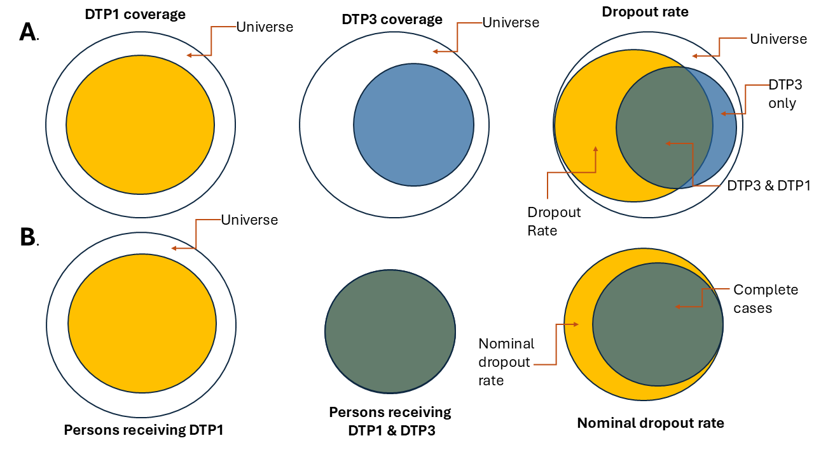

```{r setup, include=FALSE}
knitr::opts_chunk$set(echo = TRUE)
library(pahoabc)
library(dplyr)
library(ggplot2)
library(knitr)
```

# Rationale

The dropout rate is an indicator used to evaluate the loss of follow-up in vaccination schedules. It reflects the percentage of individuals who did not receive a final dose (i.e, DTP3) among those who received an initial dose (i.e, DTP1). In aggregated systems, it is estimated using the following formula:

Performing the analysis with aggregated data does not guarantee that the individuals who received both doses are the same, as shown in Figure 1a. Electronic nominal vaccination records enable a person-to-person analysis, ensuring that the individuals who received both doses are indeed the same, as illustrated in Figure 1b.

> **Note**
> 
> All functions used for nominal dropout analyses within PAHOabc begin with the `nod_` prefix.

{width=90%}
# Glossary
## Political Geographic Boundaries

Throughout this vignette, we will make reference to different levels of political geographic boundaries. These levels are defined by the country/territory and can have different names from country to country. PAHOabc is agnostic to these names and requires the user to recode their variable names to fit the PAHOabc structure.

Namely, PAHOabc can distinguish three administrative levels, which listed from top to bottom level are: ADM0, ADM1 and ADM2.

1. ADM0: The country. This is the top-most administrative level.
2. ADM1: The first geographic subdivision in the country. ADM0 contains several ADM1 subdivisions.
3. ADM2: The second geographic subdivision in the country. Each ADM1 contains several ADM2 subdivisions.

## Vaccine Names

Our example datasets use a specific naming convention for the vaccine doses. This might not match your own naming schemes, but it will not affect the usage of the package as long as you make sure to be consistent when naming vaccine doses.

For example, the vaccine names used in the PAHOabc package are:

| Abbreviation | Full Name                                                        |
|--------------|------------------------------------------------------------------|
| SRP1         | Measles, Rubella, and Mumps Vaccine (1st dose)                   |
| DTP1         | Diphtheria, Tetanus, and Pertussis Vaccine (1st dose)            |
| DTP2         | Diphtheria, Tetanus, and Pertussis Vaccine (2nd dose)            |
| DTP3         | Diphtheria, Tetanus, and Pertussis Vaccine (3rd dose)            |
| BCG RN       | Bacillus Calmette–Guérin Vaccine (at birth)                      |
| YFV1         | Yellow Fever Vaccine (1st dose)                                  |

# Usage

## Install Package

The first step to run the nominal dropout rate analysis is to install the PAHOabc package available on Github

```{r, install_package, eval=FALSE}
devtools::install_github("IM-Data-PAHO/pahoabc")
```

## Load Data

The functions in this module require you to provide your **EIR dataset** in a specific format.
To make it easy for you to test out PAHOabc's functionality and understand the structure we require for your datasets, we will now explore the example dataset provided by PAHOabc that is required by this module.

### EIR

The `pahoabc::pahoabc.EIR` data frame provides a simulated, nominal-level table representing individual vaccination events from an Electronic Immunization Registry (EIR). Each row corresponds to a single vaccination act for a person, including information on their residence, where they were vaccinated (occurrence), their date of birth, and the vaccine dose received.

```{r pahoabc-EIR, message=FALSE}
pahoabc.EIR %>% head() %>% kable(caption = "Example Electronic Immunization Registry")
```

- `ID`: Unique person identification number.
- `date_birth`: Date of birth of person. 
- `date_vax`: Date of vaccination event. 
- ADM1: Refers to the first geographic administrative level of the country.
- ADM2: Refers to the second geographic administrative level of the country.
- Residence: Refers to the place where the person lives.  
- Occurrence: Refers to the place where the vaccination event occurred.  
- `dose`: A combined variable representing the vaccine type and its corresponding dose number. For example, DTP1 refers to the first dose of a vaccine containing diphtheria, tetanus, and pertussis components.

## Nominal Dropout Analysis

PAHOabc includes the functionality to estimate the nominal dropout rate, on a per-person basis. This allows for the analysis of any pair of doses by specifying an initial dose and a final dose. For correct interpretation, the initial dose must precede the final dose in the vaccination schedule, for example: DTP1 – DTP3 or DTP1 – MCV. Additionally, it allows users to select the level of aggregation for the results, which can be at the national level or subnational levels (ADM1 or ADM2).

### Expected workflow
The `nod_dropout()` and `nod_barplot()` functions work together to perform nominal dropout analysis and visualization. The `nod_dropout()` function computes the nominal dropout and complete cases by residence across selected administrative levels, birth cohorts, and vaccines. Its output (a data table) is structured to be directly compatible with `nod_barplot()`, which generates a visualization for the data computed.


### Example

Here is a simple use case of the `nod_dropout()` function, where we compute nominal dropout for ADM 1 for DTP1 and DTP3 in our example dataset.

```{r, nom-dropout-analysis}
## Compute nominal dropout
#Runs the nominal dropout function
example_dropout <- nod_dropout(data.EIR = pahoabc.EIR,
                               vaccine_init = "DTP1", #Starting vaccine based on your dataset
                               vaccine_end= "DTP3", #Ending vaccine based on your dataset
                               geo_level = "ADM1", #Can be ADM0, ADM1 or ADM2
                               birth_cohorts = NULL #Can be a vector of years or a year
                               )

# show results in table
example_dropout %>%
  kable(digits = 3, caption = "Nominal dropout rate between DTP1 and DTP3 by ADM1 level")
```

#### Parameters accepted

-   `data`: R Structured dataframe with the variables listed above.\
-   `vaccine_init`: The name (string) of the vaccine to use as the start point of the analysis as stored in the **dose** column of the dataframe.\
-   `vaccine_end`: The name (string) of the vaccine to use as the end point of the analysis as stored in the **dose** column of the dataframe.\
-   `geo_level`: Administrative level to use, this is an optional parameter. Can be "ADM0", "ADM1" or "ADM2" as strings. Defaults to "ADM0" if ignored.
-   `birth_cohorts`(years): Parameter to segment the analysis based on the year of birth of the persons in the dataframe. This function uses the `date_birth` column in the dataframe and can be a single year or a vector of years.

The `data`, `vaccine_init`, `vaccine_end` parameters are mandatory. `geo_level` and `birth_cohorts` are optional and help to segment the data for more precise analyses.

Check the documentation of the function using ??nod_dropout() in R for additional information.

This output may be fed directly into the nod_barplot() function as shown below.

```{r, nominal_dropout_plot}
# Runs the nod_barplot function
example_dropout_plot <- nod_barplot(data=example_dropout, order="alpha")

#show plot
example_dropout_plot

```

#### Parameters accepted

The function `nod_barplot()` accepts the following parameters:

-   `data`: Dataframe` formatted from the result of the `nod_dropout()` function.
-   `order`: Organizes the bars based on three options: "alpha", "desc" or "asc", default is "alpha".
-   `within_ADM1`  Allows to filter within an ADM1 to filter and display only the ADM2 data corresponding to the specified ADM1.

#### Interpretation

This chart shows the nominal dropout per Administrative level 1 as well as a 5% line to indicate a threshold of nominal dropout. Having a high dropout rate means a large percentage of the persons analyzed are not registering for the follow up doses of their schedule. Ideally, every person that has received a dose of a multi-dose schedule should return to receive the follow up dose. In this case the administrative level **ADM1_1** is the one doing the worst, whilst the **ADM1_4** is doing the best. 

All of the administrative units have a nominal dropout rate above **25%** meaning, at least 25% of the persons in that target group **did not come back for their follow up dose**. 


# Summary

Accurately monitoring continuity in multi-dose vaccination schedules is vital for immunisation programmes. The *nominal dropout rate*—the proportion of individuals who begin a series (e.g., DTP1) but fail to receive its final dose (e.g., DTP3)—offers a person-level view of programme performance that aggregated counts cannot. This vignette introduces **PAHOabc**, an R package that streamlines nominal dropout analysis by harnessing electronic immunisation registry (EIR) data.

After defining key concepts—administrative units (ADM0–2) and standardised vaccine-dose codes—the document walks the reader through a reproducible workflow: installing the package, exploring the bundled example EIR, computing dropout with `nod_dropout()`, and visualising results with `nod_barplot()`. A worked example estimates DTP1→DTP3 dropout at the ADM1 level, revealing that every subdivision exceeds the 25 % dropout threshold; ADM1_1 performs the worst, while ADM1_4 performs the best relative to a 5 % target line.

By coupling granular EIR data with a transparent analytical pipeline, **PAHOabc** enables precise, geographically disaggregated insights into follow-up losses, equipping health authorities to target interventions where they are most needed.
